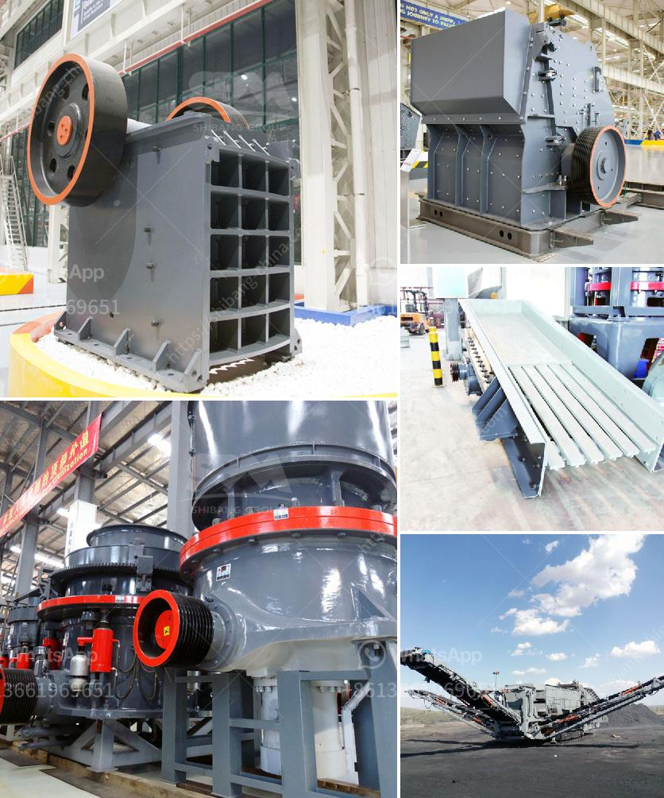

<h3>1 tonne gypsum processing machine</h3>
Gypsum, also known as calcium sulfate dihydrate, is a mineral widely used in the construction industry for various applications. To meet the increasing demand for gypsum products, manufacturers have developed innovative machines to process large quantities of this valuable mineral efficiently. One such ground-breaking machine is the one-tonne gypsum processing machine.

The one-tonne gypsum processing machine has revolutionized the construction industry by enabling faster and more efficient gypsum production. Traditionally, gypsum processing involved manual labor, which was time-consuming and physically demanding. However, with this advanced machine, the entire process is automated, significantly reducing human intervention and the associated labor costs.

This machine can process up to one tonne of gypsum per hour, making it highly productive and suitable for large-scale gypsum production facilities. It starts with the crushing and grinding of raw gypsum materials into fine particles. These particles are then fed into the machine, where they undergo further processes like heating and drying.

One of the key advantages of the one-tonne gypsum processing machine is its ability to control the temperature during the heating process accurately. Gypsum requires controlled heating to remove its excess water content and convert it into a dry powdered form suitable for various construction applications. The machine's precise temperature control ensures optimal dehydration and prevents any detrimental effects on the chemical composition of the gypsum.

Another noteworthy feature of the machine is its dust control system. Gypsum processing can generate a significant amount of dust, which poses health and safety risks to workers as well as potential contamination of the produced gypsum. The one-tonne gypsum processing machine is equipped with an efficient dust collection system that minimizes airborne particles, ensuring a safe and clean working environment.

Furthermore, this machine offers customization options to cater to different gypsum product requirements. Manufacturers can adjust parameters such as particle size, setting time, and strength development according to their specific needs. This flexibility allows for the production of gypsum products with consistent quality and desired characteristics, enhancing their usability in various construction applications.

The one-tonne gypsum processing machine not only improves the efficiency and productivity of gypsum production but also contributes to sustainability in the construction industry. By automating the processing process, it minimizes energy consumption and waste generation. Moreover, the machine incorporates environmentally friendly practices, such as recycling excess heat and water, reducing its ecological footprint.

In conclusion, the one-tonne gypsum processing machine has revolutionized the construction industry by streamlining and automating the gypsum production process. Its high productivity, precise temperature control, dust control system, and customization options make it an essential tool for manufacturers seeking efficient and sustainable gypsum processing. With the increasing demand for gypsum products in the construction sector, this machine is set to play a significant role in shaping the future of the industry.
<h3>Contact us</h3><ul><li><strong>Whatsapp:&nbsp;<a href="https://wa.me/8613661969651">+8613661969651</a></strong></li><li><a href="https://swt.shibang-china.com/?git&amp;zhl&amp;1 tonne gypsum processing machine"><strong>Online Service(chat now)</strong></a></li></ul><h3>Related</h3><ul><li><a href='grinding mill made in germany.md'>grinding mill made in germany</a></li><li><a href='small scale mining project proposal.md'>small scale mining project proposal</a></li><li><a href='usine carbonate de calcium.md'>usine carbonate de calcium</a></li><li><a href='gypsum powder grinding mill price in pakistan.md'>gypsum powder grinding mill price in pakistan</a></li><li><a href='ball mill grinding china.md'>ball mill grinding china</a></li></ul>