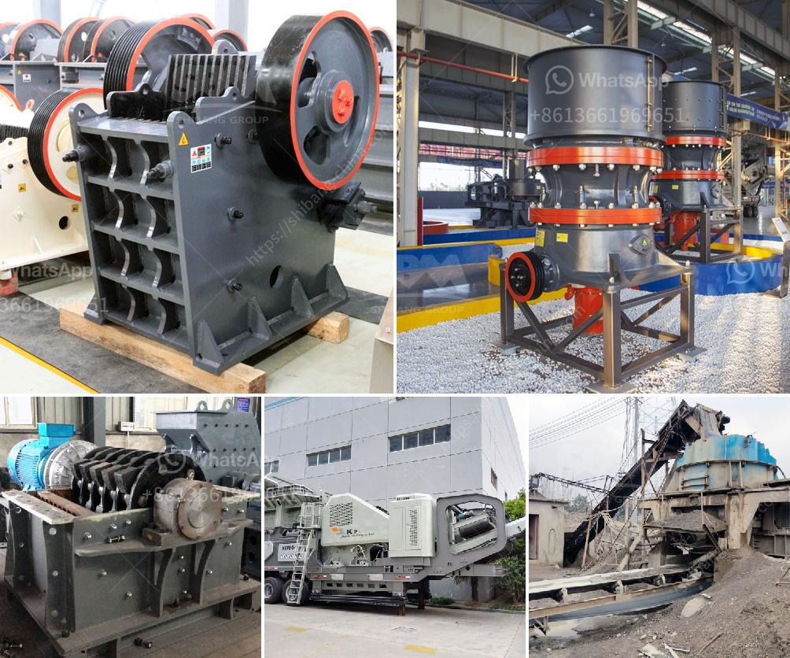

<h3>100 per ton coal crush and screen plant</h3>
The importance of coal in meeting the world's energy demands cannot be understated. Despite growing concerns about climate change and the shift towards renewable energy sources, coal still remains a significant contributor to global electricity generation. However, when it comes to coal mining, one crucial aspect is the proper processing and screening of the coal to ensure its quality and suitability for various applications. This is where a 100 per ton coal crush and screen plant comes into play.

A coal crush and screen plant, as the name suggests, is a facility that combines the crushing and screening processes required to prepare coal for use in various industries. The primary function of such a plant is to reduce the size of the coal to enable efficient transportation and combustion. This involves crushing the coal into smaller pieces and then separating it into different grades based on size.

The use of a 100 per ton coal crush and screen plant offers several advantages. Firstly, it allows for the processing of large quantities of coal in a relatively short period, ensuring a steady supply to meet energy demands. This is especially crucial in countries heavily reliant on coal for electricity generation, where constant supply is necessary to prevent power outages and disruptions.

Secondly, such a plant ensures that the coal produced meets the required quality standards. By crushing the coal to smaller sizes, the plant ensures that the coal's surface area increases, promoting better combustion efficiency. This results in lower emissions of harmful pollutants, such as sulfur dioxide and nitrogen oxides, which contribute to air pollution and climate change.

Furthermore, the use of a 100 per ton coal crush and screen plant improves the overall efficiency of the coal mining process. By screening the coal into different sizes, the plant separates the coal based on its specific properties, such as calorific value and moisture content. This enables the mining company to sell coal of different grades to different industries, optimizing the value derived from each ton of coal mined.

In addition to its practical benefits, a coal crush and screen plant also addresses environmental concerns associated with coal mining. By efficiently processing the coal, the plant minimizes wastage and reduces the need for additional mining operations. This helps to conserve natural resources and reduce the negative environmental impact of coal mining activities.

In conclusion, a 100 per ton coal crush and screen plant plays a vital role in the coal mining industry. Its ability to process large quantities of coal efficiently and produce coal of different grades ensures a steady supply of quality coal for various industries. Moreover, it promotes better combustion efficiency, reduces emissions, and optimizes the value derived from each ton of coal mined. As the world transitions towards cleaner energy sources, implementing efficient coal processing plants becomes even more critical to mitigate the environmental impact of coal mining.
<h3>Contact us</h3><ul><li><strong>Whatsapp:&nbsp;<a href="https://wa.me/8613661969651">+8613661969651</a></strong></li><li><a href="https://swt.shibang-china.com/?git&amp;zhl&amp;100 per ton coal crush and screen plant"><strong>Online Service(chat now)</strong></a></li></ul><h3>Related</h3><ul><li><a href='quarry rock stone crusher germany machine manufacturer.md'>quarry rock stone crusher germany machine manufacturer</a></li><li><a href='apline ball mill pakistan.md'>apline ball mill pakistan</a></li><li><a href='ton per hour stone crusher plant.md'>ton per hour stone crusher plant</a></li><li><a href='coal conveyor blet supplier from india.md'>coal conveyor blet supplier from india</a></li><li><a href='alluvial gold mining process.md'>alluvial gold mining process</a></li></ul>