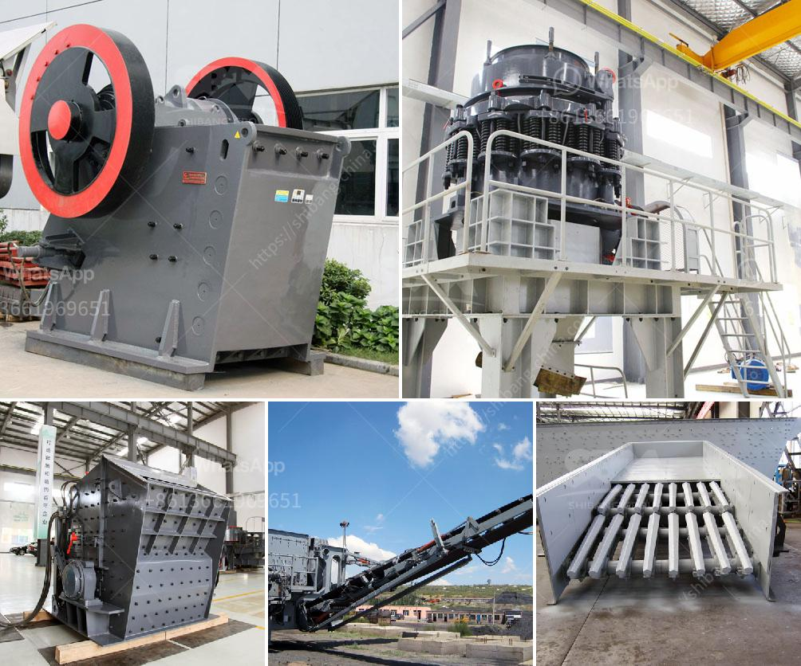

<h3>100 tpd kiln project cost</h3>
The cost of setting up a 100 TPD (Tonnes Per Day) kiln project can vary depending on various factors such as the location, size, and type of kiln, as well as the specific needs and requirements of the project. 

In general, setting up a 100 TPD kiln project can be a significant investment. The cost primarily includes equipment, construction, and operational costs. The equipment cost includes the kiln itself, stack, preheating system, and other related machinery. The construction cost includes the expenses for site preparation, civil works, installation, and commissioning. Operational costs include labor, electricity, fuel consumption, and maintenance.

Given the scale and complexity of a 100 TPD kiln project, it is crucial to ensure proper planning and budgeting. This entails conducting a feasibility study, engaging with experienced consultants or contractors, and estimating the expenses accurately. It is also important to consider potential cost overruns, unforeseen challenges, and market fluctuations while budgeting for the project.

While it is challenging to provide an exact figure for the cost of a 100 TPD kiln project without specific details, a rough estimation can range from several million to tens of millions of dollars. This cost can further increase if additional features or technologies are incorporated, such as pollution control systems or automation.

Despite the high initial investment, a 100 TPD kiln project can be economically viable in the long run. It can yield significant returns through increased production capacity, improved energy efficiency, and reduced operating costs compared to outdated or smaller kilns.

In conclusion, setting up a 100 TPD kiln project requires a substantial investment. The cost can vary depending on various factors, and it is crucial to conduct a thorough assessment and estimation before proceeding with the project. However, with proper planning and budgeting, a 100 TPD kiln project can be a profitable venture with long-term benefits.
<h3>Contact us</h3><ul><li><strong>Whatsapp:&nbsp;<a href="https://wa.me/8613661969651">+8613661969651</a></strong></li><li><a href="https://swt.shibang-china.com/?git&amp;zhl&amp;100 tpd kiln project cost"><strong>Online Service(chat now)</strong></a></li></ul><h3>Related</h3><ul><li><a href='flow diagram for limestone process.md'>flow diagram for limestone process</a></li><li><a href='used stone crusher in europe for sale.md'>used stone crusher in europe for sale</a></li><li><a href='jaw crusher used india.md'>jaw crusher used india</a></li><li><a href='ball mill capacity.md'>ball mill capacity</a></li><li><a href='graphite beneficiation.md'>graphite beneficiation</a></li></ul>