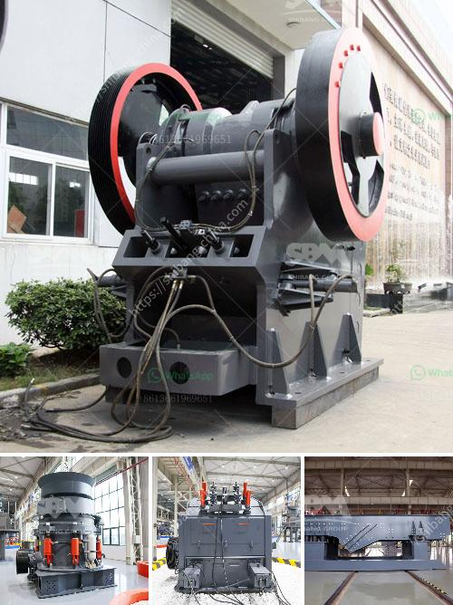

<h3>2 meter concrete crusher</h3>
The rapidly growing demand for materials in various construction projects has led to the creation of advanced machinery and equipment that can efficiently process and recycle construction waste. One such innovative machine is the 2-meter concrete crusher. This equipment has revolutionized the construction industry by providing a sustainable solution for the disposal of concrete rubble.

The 2-meter concrete crusher is a powerful machine designed to break down concrete waste into reusable aggregates. It is equipped with a hydraulic jaw mechanism that can easily crush large chunks of concrete into smaller pieces suitable for recycling. The crusher's jaw can be adjusted to produce different sizes of aggregate, ranging from 10mm to 100mm, depending on the project requirements.

One of the key advantages of using a 2-meter concrete crusher is its ability to process large quantities of material quickly. With a crushing capacity of up to 60 tons per hour, this machine can significantly reduce the time and effort required to dispose of concrete waste. Moreover, it eliminates the need for manual labor and multiple trips to the landfill, reducing the overall cost and environmental impact.

Concrete recycling not only helps reduce the strain on natural resources but also prevents the accumulation of waste in landfills. By crushing and reusing concrete waste, substantial amounts of energy and natural resources can be conserved. Additionally, recycling concrete reduces the need for new aggregate production, a process that often involves mining and quarrying, which can have detrimental effects on the environment.

The 2-meter concrete crusher is also highly versatile, making it suitable for various construction applications. It can be used to crush concrete foundations, slabs, sidewalks, and other structures, turning them into valuable aggregate that can be used in new construction projects. The recycled material can be used as a base for roads, mixed into new concrete, or even sold to other construction companies for their projects.

Furthermore, the 2-meter concrete crusher is designed with safety in mind. It is equipped with various safety features, such as an automated overload protection system, which ensures that the machine does not exceed its maximum capacity. The crusher also includes a dust suppression system, which minimizes dust generation during the crushing process, reducing health risks for workers and nearby communities.

In conclusion, the 2-meter concrete crusher offers a sustainable solution for the disposal of concrete waste in the construction industry. Its ability to quickly process large quantities of material, versatility, and focus on safety make it an indispensable tool for construction companies and contractors. By promoting concrete recycling, this innovative machine helps reduce the environmental impact of construction activities while simultaneously conserving valuable resources.
<h3>Contact us</h3><ul><li><strong>Whatsapp:&nbsp;<a href="https://wa.me/8613661969651">+8613661969651</a></strong></li><li><a href="https://swt.shibang-china.com/?git&amp;zhl&amp;2 meter concrete crusher"><strong>Online Service(chat now)</strong></a></li></ul><h3>Related</h3><ul><li><a href='rock crushers manufacturers.md'>rock crushers manufacturers</a></li><li><a href='qustion about ball milling process.md'>qustion about ball milling process</a></li><li><a href='quartz mining equipments.md'>quartz mining equipments</a></li><li><a href='project report on quartz crusher industries.md'>project report on quartz crusher industries</a></li><li><a href='portable ballast crusher for sale.md'>portable ballast crusher for sale</a></li></ul>