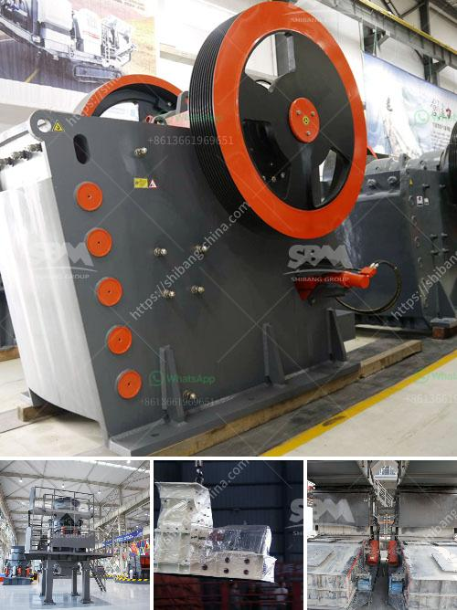

<h3>200tph crushing system in south africa</h3>
The demand for crushing machinery, particularly for crushing plants, is on the rise in South Africa. With the infrastructure development in various regions in the country, the demand for crushing machines and plants is growing. This has led to a surge in the production of crushing equipment and systems for the mining and quarrying sectors.

One of the popular crushing systems used in South Africa is the 200tph crushing system. This particular crushing plant is widely used as a primary crushing unit for different minerals, coal, and ores. It is used to crush the large-sized stones or rocks generally into smaller pieces for further processing in the mining industry.

The 200tph crushing system consists of a vibrating feeder, jaw crusher, impact crusher, vibrating screen, belt conveyor, and control system. The feed material enters the vibrating feeder from the hopper and is conveyed to the jaw crusher for primary crushing. The crushed material is then transported to the impact crusher for secondary crushing. The vibrating screen separates the final crushed material into different sizes. The belt conveyor transports the material to the next processing unit, be it a stockpile or another crushing stage.

There are several advantages of using a 200tph crushing system in South Africa. Firstly, it can process a wide range of materials, including hard rocks, abrasive minerals, and ores. This makes it suitable for various mining and quarrying applications.

Secondly, the 200tph crushing system has a high crushing ratio, which means that it can efficiently reduce the size of the material to be processed. This results in improved productivity and reduced operational costs for the mining companies.

Furthermore, the 200tph crushing system is designed with advanced technology and high-quality components, ensuring reliable performance and long service life. This reduces the maintenance requirements and downtime, allowing for continuous operation and increased production.

In conclusion, the 200tph crushing system has become an essential component in the South African mining and quarrying industry. With its ability to process a wide range of materials and high crushing ratio, it offers significant advantages for various applications. The advanced technology and high-quality components of the system ensure reliable performance and reduced operational costs. As the demand for crushing machinery continues to grow in South Africa, the 200tph crushing system is expected to play a crucial role in meeting the industry's requirements.
<h3>Contact us</h3><ul><li><strong>Whatsapp:&nbsp;<a href="https://wa.me/8613661969651">+8613661969651</a></strong></li><li><a href="https://swt.shibang-china.com/?git&amp;zhl&amp;200tph crushing system in south africa"><strong>Online Service(chat now)</strong></a></li></ul><h3>Related</h3><ul><li><a href='quarry crusher plant in malaysia.md'>quarry crusher plant in malaysia</a></li><li><a href='crusher and producton per hour.md'>crusher and producton per hour</a></li><li><a href='crusher and screening plant price south africa.md'>crusher and screening plant price south africa</a></li><li><a href='ballast making machine kenya in kenya.md'>ballast making machine kenya in kenya</a></li><li><a href='powder making machine.md'>powder making machine</a></li></ul>