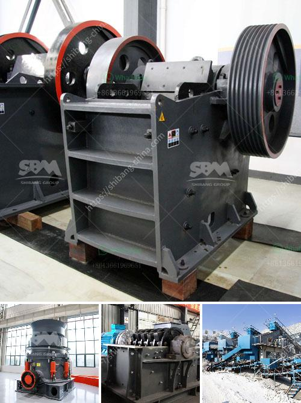

<h3>24 36 jaw crusher for sale usa</h3>
The 24×36 jaw crusher, also known as PE jaw crusher, is a primary crushing machine utilizing the most advanced crushing technology and manufacturing process. It is suitable for crushing various materials with compressive strength not exceeding 320Mpa, such as limestone, copper ore, quartzite, granite, etc. As a typical primary crusher, this product possesses a higher output and crushing ratio, while maintaining a uniform particle size distribution, making it highly efficient and reliable.

One of the key features of this jaw crusher is the ability to process hard and abrasive materials with ease. The jaw chamber is made of high-quality steel castings, manganese steel, and durable parts, guaranteeing enhanced performance and extended service life. The toggle plate and toggle plate seats are reinforced by oversized bolts and nuts, providing increased stability and rigidity during operation. This design enables the machine to withstand the toughest applications and increases its durability, ensuring long-term operation in demanding mining and quarrying environments.

Furthermore, the 24×36 jaw crusher incorporates an optimized nip angle, ensuring the smooth crushing of any material. The deep crushing chamber and large gape deliver high production rates and excellent end-product shape. The hydraulic chamber clearing system reduces downtime and maintenance costs, as it allows the crusher to quickly and easily clear any blockages within the chamber.

In terms of power and capacity, the 24×36 jaw crusher is equipped with a powerful motor, suitable for both primary and secondary crushing operations. The machine's large feed opening can handle coarse-sized materials, reducing the need for additional equipment or second-stage crushing. With a capacity ranging from 30 to 720 tph, this jaw crusher is ideal for a wide range of applications, including construction, demolition, mining, and recycling.

For customers in the USA looking for a 24×36 jaw crusher for sale, there are certainly plenty of options to choose from. Various manufacturers offer this crusher in a range of configurations, with different features and capabilities. One of the best ways to ensure the quality and reliability of the machine is to buy from a reputable and trusted supplier known for delivering high-performance crushers.

When purchasing a crusher, it's also crucial to consider the after-sales services provided by the supplier. This may include installation, maintenance, and spare parts availability, ensuring the crusher continues to operate optimally throughout its lifespan. With a reliable supplier, customers can have peace of mind knowing they can receive prompt support when needed.

Overall, the 24×36 jaw crusher is a powerful machine that offers superior crushing performance. Its robust design ensures reliability and durability, making it a valuable investment for any mining or quarrying operation. With numerous options available in the market, customers in the USA can find a suitable 24×36 jaw crusher for sale that meets their specific requirements, providing them with years of efficient and trouble-free operation.
<h3>Contact us</h3><ul><li><strong>Whatsapp:&nbsp;<a href="https://wa.me/8613661969651">+8613661969651</a></strong></li><li><a href="https://swt.shibang-china.com/?git&amp;zhl&amp;24 36 jaw crusher for sale usa"><strong>Online Service(chat now)</strong></a></li></ul><h3>Related</h3><ul><li><a href='project report on quartz crusher industries.md'>project report on quartz crusher industries</a></li><li><a href='process of making talcum powder.md'>process of making talcum powder</a></li><li><a href='gold mill tailings processing equipment.md'>gold mill tailings processing equipment</a></li><li><a href='crushing companies in the usa.md'>crushing companies in the usa</a></li><li><a href='puzzolana tph cone crusher plant prices.md'>puzzolana tph cone crusher plant prices</a></li></ul>