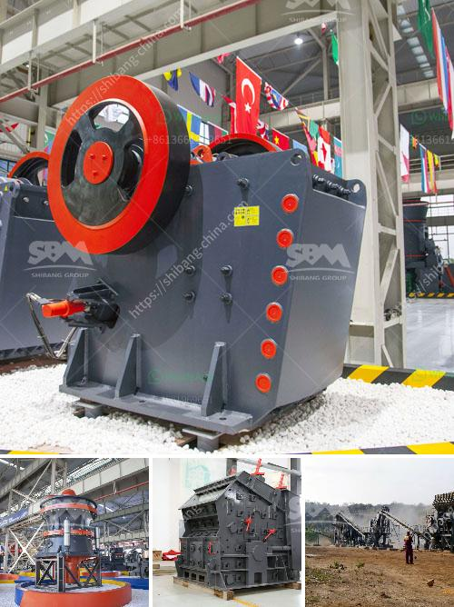

<h3>300 tph jaw crusher</h3>
The jaw crusher is a commonly used mining equipment for stone crushing. It is widely used in mining, metallurgy, building materials, highways, railways, water conservancy and chemical industries. According to the processing capacity, the jaw crusher can be divided into three categories: small, medium and large. The maximum feeding size of the small jaw crusher is 400mm, and the maximum feeding size of the medium and large jaw crusher is 800mm. It is widely used in various processing industries.

Among them, the 300 tph jaw crusher is one of the commonly used crushers. How much is the 300 tph jaw crusher? Many customers are concerned about this issue. In fact, the price of a jaw crusher is not fixed because different manufacturers have different production capabilities and technologies. The price will also be affected by factors such as raw materials, market supply and demand, and economic development levels. Therefore, it is recommended that customers choose a regular manufacturer to purchase.

The 300 tph jaw crusher is mainly equipped with a vibrating feeder, jaw crusher and vibrating screen. Through the feeder, the large stone is uniformly and continuously conveyed to the jaw crusher for crushing. After the initial crushing, the material is screened by the vibrating screen and then enters the secondary crushing chamber for fine crushing.

The output size of the finished product after crushing is 0-100mm, which can be directly used for construction and infrastructure projects. The 300 tph jaw crusher is suitable for primary and secondary crushing of all kinds of minerals and rocks with compressive strength less than 320 MPa.

In addition to the 300 tph jaw crusher, our company also produces other crushing equipment. Among them, cone crushers and impact crushers are commonly used secondary crushers. Our cone crushers have the features of reasonable price and various types, such as the fluid pressure cone crusher and PYB cone crusher. The China cone crusher can complete the rough, medium and fine crushing of the materials.

Impact crusher, as a typical primary or secondary crushing equipment, is widely used in building aggregates, mining processing and other fields. PF series impact crusher adopts the latest manufacturing technology and unique structure. The final products it produced are near to cube, have no tension and crack, and have a perfect grain shape.

In conclusion, the jaw crusher is specially designed for crushing stones and ores with a compressive strength of less than 320MPa. It has the characteristics of large crushing ratio, uniform product size, simple structure, reliable work, easy maintenance, and low operation cost. Therefore, it is widely used in metallurgy, mining, building materials, highways, water conservancy, chemical industry, and other industries. It is an ideal choice for coarse and medium crushing of materials.
<h3>Contact us</h3><ul><li><strong>Whatsapp:&nbsp;<a href="https://wa.me/8613661969651">+8613661969651</a></strong></li><li><a href="https://swt.shibang-china.com/?git&amp;zhl&amp;300 tph jaw crusher"><strong>Online Service(chat now)</strong></a></li></ul><h3>Related</h3><ul><li><a href='bauxite ore business plan pdf.md'>bauxite ore business plan pdf</a></li><li><a href='mobile concrete crusher.md'>mobile concrete crusher</a></li><li><a href='jaw crusher for sale in nigeria.md'>jaw crusher for sale in nigeria</a></li><li><a href='used mobile crushing plant trailer.md'>used mobile crushing plant trailer</a></li><li><a href='mobile chrome crusher suppliers in south africa.md'>mobile chrome crusher suppliers in south africa</a></li></ul>