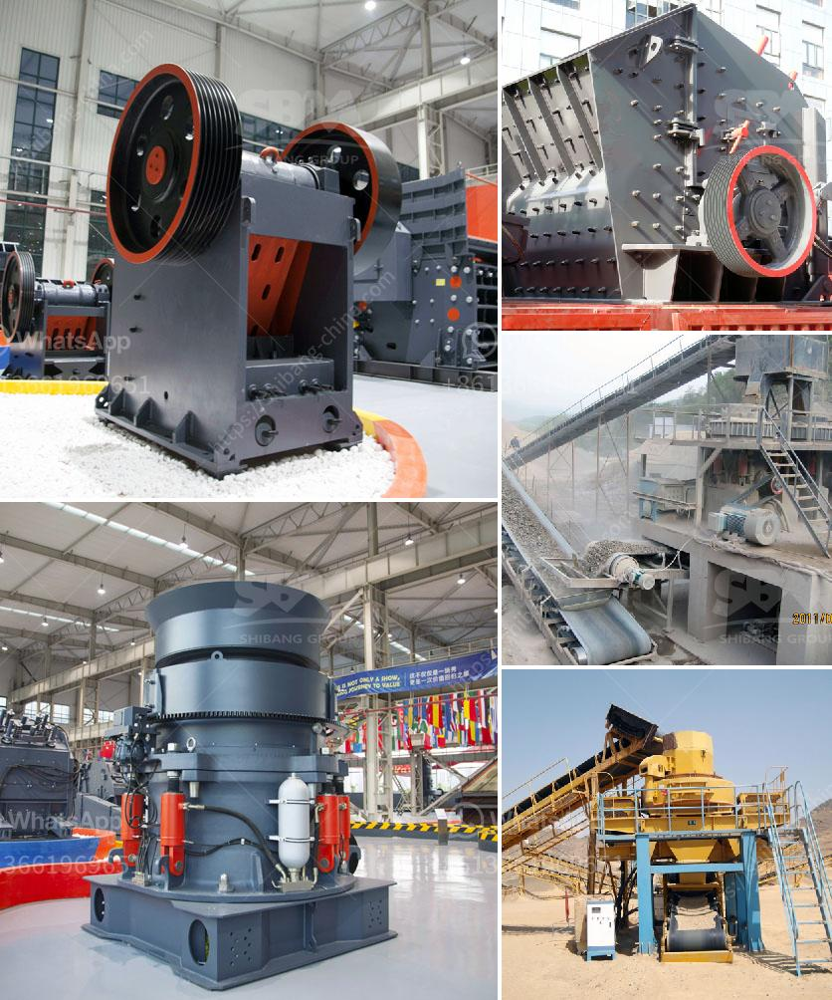

<h3>300tph mobile crushing plant</h3>
In today's modern world, demands for construction materials are increasing at an unprecedented rate. To meet these demands efficiently, the construction industry relies heavily on advanced machinery and equipment. One such innovative solution is the 300tph mobile crushing plant, which has revolutionized the way materials are processed.

Traditionally, stationary crushing plants were used to process materials for construction projects. However, with the advent of mobile crushing plants, construction companies now have the flexibility to move their operations to different sites, reducing transportation costs and increasing efficiency.

The 300tph mobile crushing plant is designed for a wide range of applications, including crushing aggregates, minerals, and ores. The plant comes with a vibrating feeder, one jaw crusher, and a vibrating screen, allowing it to process a wide range of materials with a high degree of efficiency.

With its powerful jaw crusher, the 300tph mobile crushing plant can crush even the hardest rocks, ensuring high quality and consistency of the final products. The plant's capacity of 300 tons per hour offers efficient production, making it a popular choice for large-scale construction projects.

One of the key advantages of the 300tph mobile crushing plant is its exceptional mobility. It is equipped with heavy-duty tracks and can be easily transported from one site to another, thereby reducing downtime and enabling quick setup. The plant can be operational within minutes, allowing for maximum utilization of time and resources.

The 300tph mobile crushing plant is equipped with an advanced control system that ensures smooth and reliable operation. The intuitive interface allows operators to monitor and control various parameters, such as material feed rate, crusher speed, and discharge conveyors. This intelligent system enhances productivity, while minimizing the risk of downtime due to human error.

Compared to traditional stationary crushing plants, the 300tph mobile crushing plant offers several cost-saving benefits. By eliminating the need for transportation, construction companies can save on logistical expenses. Moreover, the plant's efficient design leads to higher productivity, reducing operating costs in the long run.

The 300tph mobile crushing plant is designed with environmental sustainability in mind. It is equipped with dust suppression systems, minimizing dust emissions and ensuring a cleaner working environment. Additionally, the plant's low noise operation reduces noise pollution, making it suitable for urban areas.

The 300tph mobile crushing plant has emerged as a game-changer in the construction industry, delivering efficiency, versatility, and cost-effectiveness in one package. Its ability to process a wide range of materials with exceptional production capacity, coupled with its mobility and environmental-friendly design, makes it an ideal choice for construction projects around the world. As demands for construction materials continue to rise, embracing technological innovations like the 300tph mobile crushing plant will undeniably lead to improved project outcomes and a more sustainable future for the construction industry.
<h3>Contact us</h3><ul><li><strong>Whatsapp:&nbsp;<a href="https://wa.me/8613661969651">+8613661969651</a></strong></li><li><a href="https://swt.shibang-china.com/?git&amp;zhl&amp;300tph mobile crushing plant"><strong>Online Service(chat now)</strong></a></li></ul><h3>Related</h3><ul><li><a href='china clay washing equipment for sale.md'>china clay washing equipment for sale</a></li><li><a href='labaratory ball mill for minerals.md'>labaratory ball mill for minerals</a></li><li><a href='pe 100 jaw crusher.md'>pe 100 jaw crusher</a></li><li><a href='china mini rock crusher.md'>china mini rock crusher</a></li><li><a href='crushing plants for sale in south africa.md'>crushing plants for sale in south africa</a></li></ul>