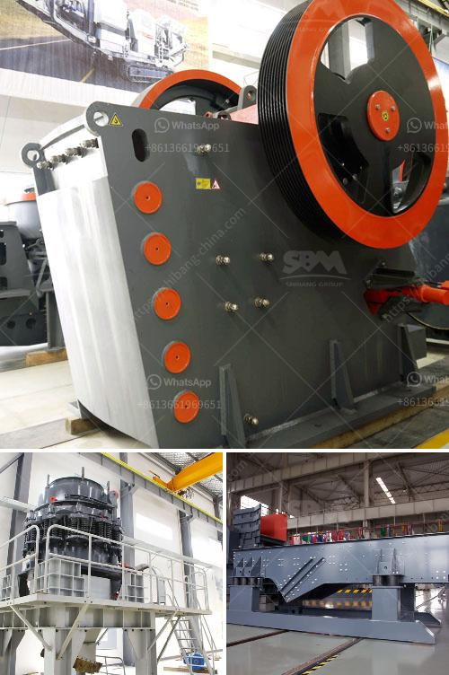

<h3>35 in raymond vertical roller mill</h3>
The Raymond Vertical Roller Mill is a well-known industrial mill due to its excellent quality and cost-effective price. Over the years, this mill has been highly praised by many customers in the mining and construction industries. Its advanced structure, reliable performance, and efficient grinding process have made it a staple in the industry.

One of the key components of the Raymond Vertical Roller Mill is its grinding roller assembly. This assembly consists of a grinding roller, a frame, an oil chamber, and a blower. The grinding roller uses high-quality and high-strength materials, ensuring its durability and stability during operation. The frame provides support and ensures the stability of the grinding roller assembly, while the oil chamber lubricates and cools the bearing. Finally, the blower filters the air, ensuring smooth and efficient operation of the mill.

The Raymond Vertical Roller Mill can grind various materials with a Mohs hardness of less than 9.3. This includes minerals and rocks such as limestone, marble, gypsum, barite, feldspar, talc, and coal. The mill can achieve a fineness of 300-500 mesh, giving customers a wide range of choices when it comes to particle size.

When operating the Raymond Vertical Roller Mill, it is important to follow the instructions provided by the manufacturer. The mill should be properly installed and maintained to ensure its long-term performance. The grinding roller assembly should be inspected regularly for any wear or damage. If necessary, the worn or damaged parts should be replaced to avoid any operational issues.

In terms of energy consumption, the Raymond Vertical Roller Mill is relatively low. The mill uses an advanced air blower system to circulate air for repeated grinding, reducing energy consumption and increasing production efficiency. This not only saves energy but also reduces production costs for customers. Additionally, the mill is equipped with a dust collector system, ensuring a clean and environmentally friendly working environment.

Overall, the Raymond Vertical Roller Mill is a reliable and efficient mill for customers in the mining and construction industries. Its advanced structure, excellent performance, and low energy consumption have made it a popular choice among customers. With a fineness range of 300-500 mesh and the ability to grind various materials, this mill offers customers a wide range of options. Proper installation and maintenance of the mill are essential to maximize its performance and longevity.
<h3>Contact us</h3><ul><li><strong>Whatsapp:&nbsp;<a href="https://wa.me/8613661969651">+8613661969651</a></strong></li><li><a href="https://swt.shibang-china.com/?git&amp;zhl&amp;35 in raymond vertical roller mill"><strong>Online Service(chat now)</strong></a></li></ul><h3>Related</h3><ul><li><a href='nigeria cone crusher.md'>nigeria cone crusher</a></li><li><a href='mobile crusher wanted for rent in johor.md'>mobile crusher wanted for rent in johor</a></li><li><a href='coal crushing process.md'>coal crushing process</a></li><li><a href='gold hammer mills in harare zimbabwe.md'>gold hammer mills in harare zimbabwe</a></li><li><a href='granite tiles processing machines.md'>granite tiles processing machines</a></li></ul>