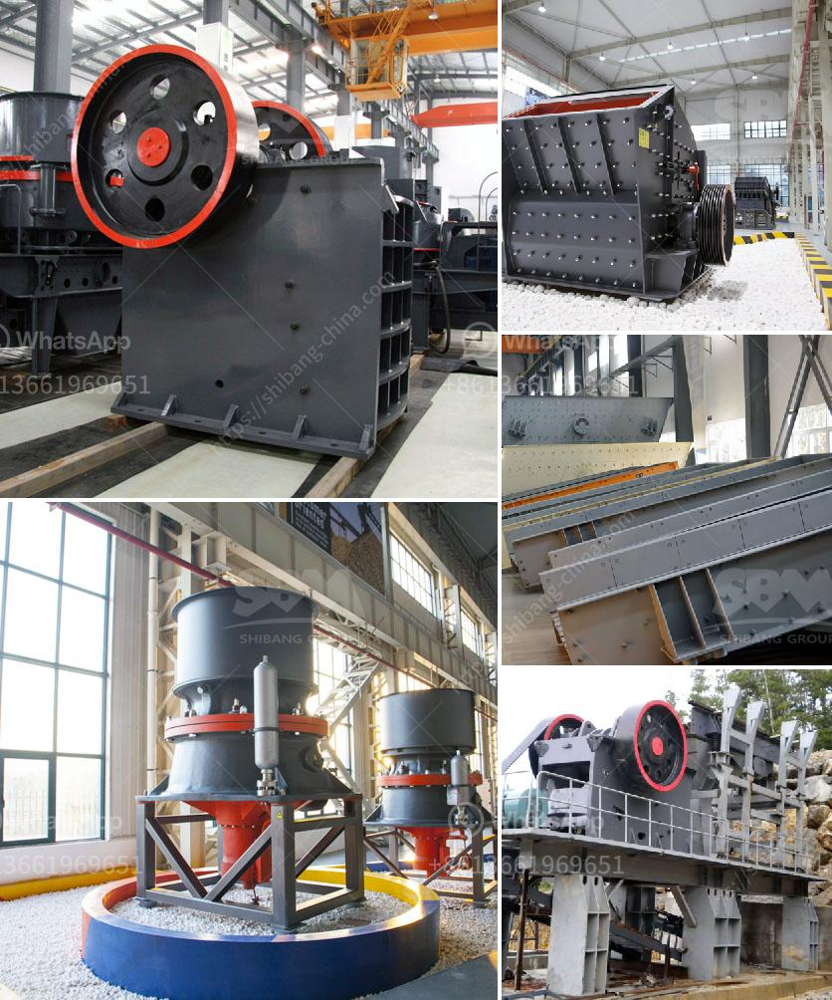

<h3>50tph stone crusher in germany</h3>
50tph stone crusher in Germany is suitable for crushing stone materials with low hardness, such as limestone, limestone, etc. During the operation of stone crusher, the crushed material is generally selected from hard materials such as basalt. Therefore, it has high construction efficiency, low operating cost and high resource utilization.

The 50tph stone crusher in Germany can be used for processing limestone, basalt, granite, slag, and other materials with a compressive strength of not more than 320MPa. The machine can be used for sand making and stone crushing.

As a manufacturer of mining machinery, SBM 50tph stone crusher in Germany has excellent performance and is welcomed by users. The machine is an indispensable equipment in various crushing equipment, owing to its strong crushing capacity and high output.

The 50tph stone crusher in Germany can crush hard materials such as slag, stones, granite, etc. It is not only used in the production line of sand and gravel, but also widely used in mining, smelting, construction materials, road and railway construction, water conservancy and chemical industries.

The 50tph stone crusher in Germany has many crushing cavities, which can be selected according to the actual needs of users to achieve free crushing of stones. It mainly relies on the rotary motion of the movable cone and the friction between the lining plate and the moving cone to crush the material.

The working principle of the 50tph stone crusher in Germany is simple. The working part consists of two jaw plates, one is fixed jaw plate (fixed jaw), the other is movable jaw plate (moving jaw). The position of the moving jaw plate is inclined, and the fixed jaw plate forms a large and narrow crushing chamber with the movable jaw plate.

The crushed material is discharged from the bottom of the crushing chamber. The discharge granularity can be adjusted by adjusting the gap between the two jaw plates. The performance characteristics of the 50tph stone crusher in Germany are as follows:

4. The gasket type discharge adjusting device is reliable and convenient, with a large adjustment range, increasing the flexibility of the machine.

In conclusion, 50tph stone crusher in Germany has excellent performance and is welcomed by the majority of users. It is an ideal equipment for the personal representative of medium and large stones in the industry. Therefore, it is highly recommended by the mining machinery industry.
<h3>Contact us</h3><ul><li><strong>Whatsapp:&nbsp;<a href="https://wa.me/8613661969651">+8613661969651</a></strong></li><li><a href="https://swt.shibang-china.com/?git&amp;zhl&amp;50tph stone crusher in germany"><strong>Online Service(chat now)</strong></a></li></ul><h3>Related</h3><ul><li><a href='tph granite crushing plant for sale.md'>tph granite crushing plant for sale</a></li><li><a href='crusher machine in bhutan.md'>crusher machine in bhutan</a></li><li><a href='limestone ore concentration plant.md'>limestone ore concentration plant</a></li><li><a href='process of making talcum powder.md'>process of making talcum powder</a></li><li><a href='gold processing plant equipment price.md'>gold processing plant equipment price</a></li></ul>