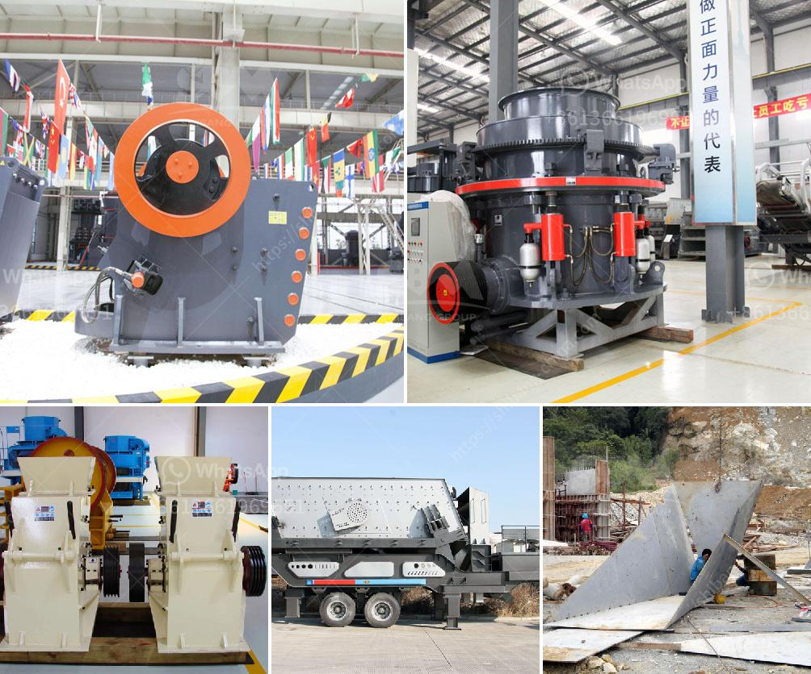

<h3>activated carbon gold mining processing equipment supplier</h3>
Activated carbon, also known as activated charcoal, plays a vital role in the gold mining industry. It is widely used for extracting gold from ore deposits. As the demand for gold continues to rise, mining companies are seeking efficient and cost-effective methods to extract the precious metal from the ore. Activated carbon has emerged as an invaluable tool in this process, as it adsorbs the gold particles present in the ore and allows for easy separation.

One of the key equipment suppliers for gold mining in today’s market is Sepor, Inc. Sepor’s high-quality activated carbon gold mining equipment efficiently captures gold particles, allowing for the separation and removal of this valuable material. The company offers a wide range of equipment options, including carbon columns, carbon tanks, and carbon screen separators, to cater to the unique needs of each mining project.

One of the primary equipment used in gold mining is the carbon column. Here, the activated carbon is mixed with the ore slurry and water, creating a liquid-solid mixture. The gold particles are then adsorbed onto the activated carbon, forming what is known as a carbon-in-column process. The mixture flows through the column, and as it does, the gold-loaded activated carbon adsorbs the gold. This process efficiently separates the gold from the ore, enabling easy extraction.

Carbon tanks are another essential equipment supplied by Sepor, Inc. These tanks are used in the carbon-in-pulp (CIP) process, where the activated carbon is mixed directly with the pulp, rather than in a column. The gold particles are adsorbed onto the carbon, creating a gold-loaded carbon that can be easily separated from the pulp. The carbon tanks supplied by Sepor, Inc. are designed to ensure optimum efficiency and maximum gold recovery.

In addition to carbon columns and carbon tanks, Sepor, Inc. also offers carbon screen separators. These separators are used to separate the gold-loaded carbon from the pulp in the CIP process. The carbon is typically retained on a screen, while the pulp passes through, resulting in the separation of the two components. The carbon screen separators provided by Sepor, Inc. are highly efficient and allow for easy maintenance and operation.

In conclusion, the demand for gold continues to drive the gold mining industry, and efficient extraction methods are more critical than ever. Activated carbon has become an indispensable tool in this process, allowing for the adsorption and separation of gold particles from the ore. Sepor, Inc. is a leading supplier of high-quality activated carbon gold mining processing equipment, offering a wide range of equipment options for gold extraction processes such as carbon columns, carbon tanks, and carbon screen separators. With their unwavering commitment to quality and customer satisfaction, Sepor, Inc. is an ideal choice for any gold mining project.
<h3>Contact us</h3><ul><li><strong>Whatsapp:&nbsp;<a href="https://wa.me/8613661969651">+8613661969651</a></strong></li><li><a href="https://swt.shibang-china.com/?git&amp;zhl&amp;activated carbon gold mining processing equipment supplier"><strong>Online Service(chat now)</strong></a></li></ul><h3>Related</h3><ul><li><a href='small washing plants diamonds.md'>small washing plants diamonds</a></li><li><a href='lister grinding mill in kenya.md'>lister grinding mill in kenya</a></li><li><a href='small ball mill for sale.md'>small ball mill for sale</a></li><li><a href='ball mill pulverizer.md'>ball mill pulverizer</a></li><li><a href='gypsum board making machine.md'>gypsum board making machine</a></li></ul>