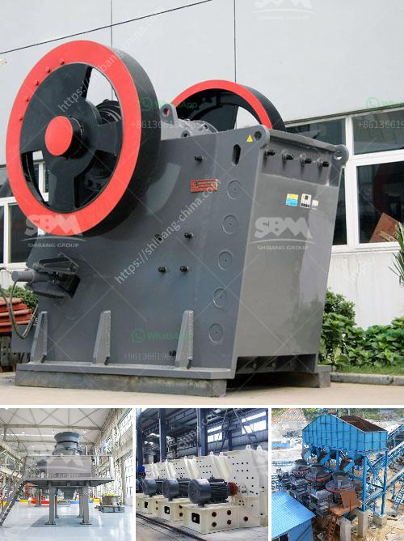

<h3>activated carbon plant business plan</h3>
Activated carbon is a highly versatile material used in various industries for its excellent adsorption properties. It is extensively utilized in water treatment, air purification, pharmaceuticals, food processing, and many other applications. With the increasing demand for clean water and air, the need for activated carbon is rapidly growing, making the activated carbon plant business a lucrative venture.

To start an activated carbon plant, a well-structured business plan is essential. The first step is to conduct thorough market research to identify the demand and potential customers. Understanding the specific requirements of different industries will help in tailoring the manufacturing process and product range accordingly.

The next crucial aspect is the selection of a suitable location for the plant. It should have easy access to raw materials like coconut shells, wood, coal, or agricultural waste, which are the primary sources of activated carbon production. Additionally, proximity to transportation routes and major markets should also be considered.

Acquiring the necessary machinery and equipment is another significant investment. Specialized carbonization, activation, and purification techniques must be employed to ensure high-quality activated carbon. Additionally, adequate storage facilities, packaging materials, and quality control laboratories are essential to maintain the product's integrity.

Building a strong supply chain network is vital to procure raw materials consistently and deliver the finished product to customers on time. Developing strategic partnerships with suppliers and distributors can ensure smooth operations and maximize profitability.

Marketing and promotion play a crucial role in attracting customers and creating brand awareness. Developing a robust marketing strategy and investing in digital marketing techniques can help reach potential clients globally. Participating in relevant industry trade shows and exhibitions can also generate leads and showcase the product's quality and capabilities.

Furthermore, it is essential to continuously invest in research and development to explore newer applications and improve product efficiency. By staying updated with the latest advancements and customer demands, the company can maintain a competitive edge in the market.

In conclusion, starting an activated carbon plant requires careful planning, market analysis, and significant financial investment. With the growing demand for activated carbon, this business can be profitable and sustainable. However, entrepreneurs must ensure a robust business plan, focus on quality, and continually adapt to changing industry trends to succeed in this competitive sector.
<h3>Contact us</h3><ul><li><strong>Whatsapp:&nbsp;<a href="https://wa.me/8613661969651">+8613661969651</a></strong></li><li><a href="https://swt.shibang-china.com/?git&amp;zhl&amp;activated carbon plant business plan"><strong>Online Service(chat now)</strong></a></li></ul><h3>Related</h3><ul><li><a href='track mounted mobile crusher plant.md'>track mounted mobile crusher plant</a></li><li><a href='silica sand washing and grinding.md'>silica sand washing and grinding</a></li><li><a href='small scale gold refinery plant equipments.md'>small scale gold refinery plant equipments</a></li><li><a href='gold recovery equipment for small mining companies.md'>gold recovery equipment for small mining companies</a></li><li><a href='bentonite production process.md'>bentonite production process</a></li></ul>