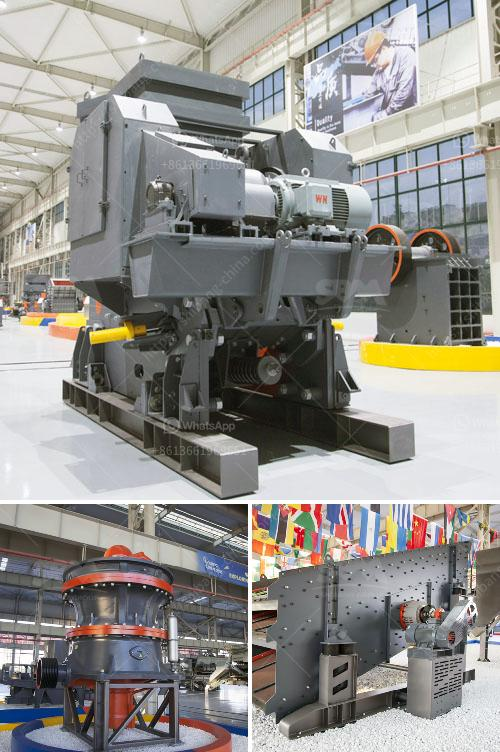

<h3>address of stone crasher plant in westbengal</h3>
Stone crusher plant is a machine designed to reduce the large stone, granites, marble, lime rocks into the smaller size and output gravel, dust, different size of the material. Stone crusher plants used worldwide. It is available with different-2 capacity, design, and utility. Uses of Crusher plant Stone crushing industry engaged in producing a crushed stone that used as a raw material for infrastructure projects like, road, highway, bridges, building canals, etc. All projects are considered as the core infrastructure work that gives the economy boom. Stone crusher units are not alone. Along with these plants, stone mining also associated. In fact, stone mining is the primary activity, and the crushing plant is the secondary activity that can be considered. The stone crushing plant consists of vibrating feeder, jaw crusher, impact crusher, vibrating screen, belt conveyor, and centralized electric control. The designed output is 50-800t/h, and cone crusher and dust removing equipment can be equipped to satisfy different processing needs of the customers.

Stone crushing plant, a new designed stone crushing & screening plant, also called mobile crusher, portable crusher, is flexible, convenient and strong in mobility. It can save a large construction capital and relocation. Raw materials can be broken at the locale without being transported again, and also can be moved with the promotional exploitation of the raw material, which saves a large number of transportation costs. SBM is a professional crushing plant manufacturer in China, engaged in manufacturing of metal crusher, roller crusher, river stone crusher, vsi sand crusher, coal crusher, mobile crushing plant to cater different demands of the customers. The booming infrastructure of the country has led to the increase in demand of stone crusher plants. Every project whether it is a road project, hydropower project, or residential construction project requires stone aggregates. The crushing plant is used to produce a variety of aggregate products which can be delivered. As a famous stone crushing machine manufacturer, SBM can provide clients the high-quality machine and low stone.

In West Bengal, the location of stone crusher plant is relatively scattered. All the units are located at different locations where the raw materials, availability is quite high. It is common to have units in clusters with the stone crushing units operating at different locations.

The stone crusher plant address in West Bengal can be found in various districts like Birbhum, Bankura, Purulia, Jhargram, and Darjeeling. The stone crusher plant in Birbhum district is mainly composed of impact crusher, jaw crusher, cone crusher, VSI crusher, vibrating screen, belt conveyor, and centralized electric control. The production capacity of this plant is about 100-300 tons/hour. Darjeeling district consists of mainly rainy seasons which require additional dust control measures compared to other districts. The crusher plant in Darjeeling district also follows similar configuration as in Birbhum district. The stone crusher plant in West Bengal mainly employs workers such as stone crushers, clerks, electricians, plumbers, etc.

In West Bengal, the major problem with quarrying in Birbhum district is the working condition of women workers as the ‘stone crusher plant in Birbhum district’. Women face problems of sexual harassment due to poor implementation of legal and social rights followed by the employers. The hazardous work and lack of safety measures for workers have been common issues faced by the workers in West Bengalstone crusher plant in Birbhum district.

To conclude, the stone crusher plant in West Bengal is mainly located in Birbhum district and the stone crusher plant in Darjeeling is located in Darjeeling district. While there are ample opportunities for employment, proper and ethical work conditions, and worker safety need to be ensured. The government and other stakeholders should implement policies and regulations to improve the working conditions for workers in the stone crusher plants.
<h3>Contact us</h3><ul><li><strong>Whatsapp:&nbsp;<a href="https://wa.me/8613661969651">+8613661969651</a></strong></li><li><a href="https://swt.shibang-china.com/?git&amp;zhl&amp;address of stone crasher plant in westbengal"><strong>Online Service(chat now)</strong></a></li></ul><h3>Related</h3><ul><li><a href='grinding mill machine price.md'>grinding mill machine price</a></li><li><a href='quartz powder plant nigeria.md'>quartz powder plant nigeria</a></li><li><a href='dolomite crusher price.md'>dolomite crusher price</a></li><li><a href='carbomer ball mill.md'>carbomer ball mill</a></li><li><a href='quarry crushing equipment.md'>quarry crushing equipment</a></li></ul>