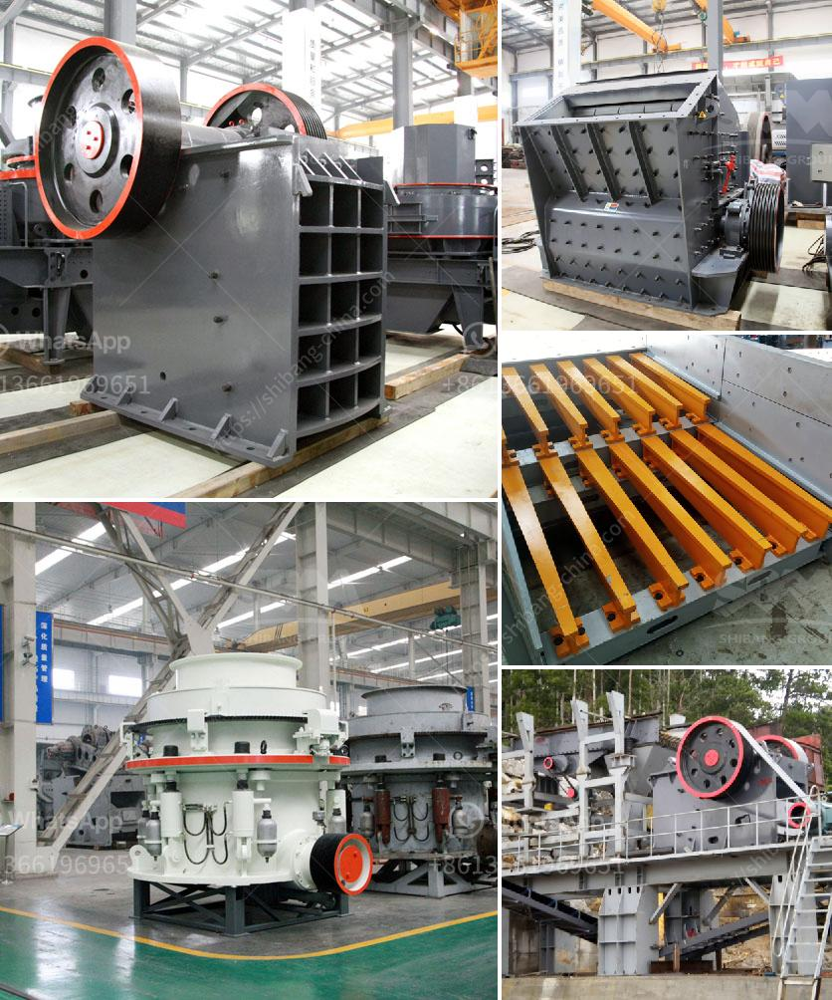

<h3>aggregate crushers south africa</h3>
Aggregate crushers are used to break down rocks into small particles for various construction projects such as roads, highways, bridges, buildings, etc. South Africa has a thriving aggregate industry, with numerous stone quarries supplying the region with various types of crushed aggregate materials. Aggregate crushers south Africa is also a perfect fit for tight set-ups designed for installation in accidents sensitive environments.

Easy to use and maintain, the crusher has a number of features that make it ideal for various advanced crushing applications. It is specifically designed to ensure rugged reliable operation coupled with a greater crushing capacity and a consistent end product.

One of the key advantages of aggregate crushers South Africa is their ability to produce a large quantity of uniformly sized aggregates. This allows contractors to use them in many construction projects as they deliver quality materials at a low cost.

Another benefit associated with aggregate crushers South Africa is their versatility. They can process a wide range of materials, including cement, sand, crushed stones, gravel, recycled concrete. These materials can be used in various applications such as road base, filling, leveling, landscaping, and drainage.

The crushers are often equipped with screens that separate the crushed materials based on their size, enabling contractors to produce aggregates of various sizes, depending on their needs. This ensures that materials are used efficiently in different stages of the construction process, reducing waste and maximizing their usefulness.

Aggregate crushers South Africa also boasts an efficient dust suppression system, allowing contractors to meet emission regulations and improve air quality on job sites. The dust suppression system prevents the spread of dust particles during the crushing process, creating a safer and healthier working environment.

In addition, many aggregate crushers South Africa are equipped with automation systems that allow operators to remotely control and monitor the crushing process. This not only ensures safe operation but also improves productivity by reducing downtime and optimizing the performance of the equipment.

Furthermore, aggregate crushers South Africa are designed with energy efficiency in mind. They are equipped with advanced motors that consume less power while delivering high crushing capacities. This not only reduces operational costs but also contributes to environmental sustainability by minimizing energy consumption and carbon emissions.

To summarize, aggregate crushers South Africa are essential equipment in the construction industry, providing contractors with reliable, versatile, and cost-effective solutions for their projects. These crushers are designed to produce uniformly sized aggregates from a wide range of materials, ensuring their usefulness in various construction applications. Equipped with advanced features such as dust suppression systems and automation systems, aggregate crushers South Africa promote safety, productivity, and environmental sustainability. With their energy-efficient motors, these crushers not only reduce operational costs but also contribute to a greener future.
<h3>Contact us</h3><ul><li><strong>Whatsapp:&nbsp;<a href="https://wa.me/8613661969651">+8613661969651</a></strong></li><li><a href="https://swt.shibang-china.com/?git&amp;zhl&amp;aggregate crushers south africa"><strong>Online Service(chat now)</strong></a></li></ul><h3>Related</h3><ul><li><a href='flow chart for gold extraction from ores.md'>flow chart for gold extraction from ores</a></li><li><a href='copper ore processing plant kenya.md'>copper ore processing plant kenya</a></li><li><a href='rental crusher vertical.md'>rental crusher vertical</a></li><li><a href='gold hammer mills for sale south africa.md'>gold hammer mills for sale south africa</a></li><li><a href='screener crusher china.md'>screener crusher china</a></li></ul>