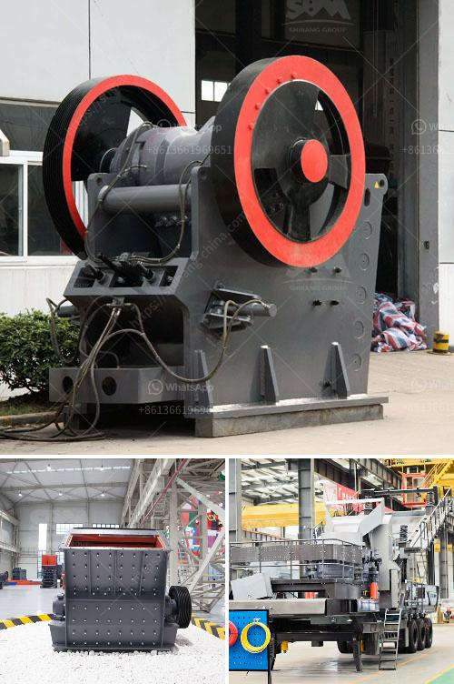

<h3>aggregate crushing machine</h3>
Aggregate crushing machines are used to reduce particles of varying sizes in different industries. They are used in the mining industry, construction sites, and other sectors to break large rocks down into smaller, more manageable pieces. Aggregate crushing machines are pivotal equipment in the production of construction aggregates and are widely used in the mining industry due to their high efficiency and high-quality end products.

The process of aggregate crushing involves several stages. Primary crushing is handled by a jaw crusher, which reduces large rocks into smaller pieces. Secondary and tertiary crushing can be done using gyratory crushers, cone crushers, or impact crushers. These machines break up the rocks into smaller fragments by applying pressure, impact, or shearing forces. Once the rocks have been broken down, they are screened to separate the desired aggregate size. This screening process ensures that the final product meets the required specifications.

One of the key features of aggregate crushing machines is their ability to provide precise crushing in a variety of settings. This versatility makes them ideal for use in various applications, such as producing aggregates for road construction, concrete production, and asphalt production. The machines can also be used to crush hard, abrasive rocks, making them suitable for mining operations.

The design of aggregate crushing machines is focused on achieving high crushing efficiency while ensuring the quality of the end product. The machines are designed to withstand heavy-duty applications and harsh operating conditions. They are equipped with robust components, such as heavy-duty jaw plates, impact plates, and cone crusher liners, which are designed to prolong the lifespan of the machine. Additionally, advanced technology and automation features are incorporated into the machines to enhance their performance and reduce downtime.

As environmental concerns become increasingly important, manufacturers have developed aggregate crushing machines that are more energy-efficient and eco-friendly. Many machines now incorporate features such as low power consumption, reduced noise levels, and dust suppression mechanisms. These features not only contribute to a cleaner environment but also reduce operating costs for operators.

Aggregate crushing machines play a crucial role in the production of high-quality aggregates. The quality of the aggregates produced depends on the crushing machine used, its performance, and the methods used to produce the aggregates. One prominent example of a high-quality aggregate crushing machine is the cone crusher. Cone crushers are used for crushing ores and rocks, and the advantages of the machine are high production capacity, fine product size, and reliable performance.

In summary, aggregate crushing machines are pivotal equipment in the mining industry and construction sites. They are designed to crush a variety of materials, including rocks, granite, and minerals, into smaller, more manageable pieces. These machines ensure high crushing efficiency and produce high-quality aggregates, making them essential for various applications. Manufacturers continue to develop environmentally-friendly and energy-efficient machines to meet the demands of both operators and regulators.
<h3>Contact us</h3><ul><li><strong>Whatsapp:&nbsp;<a href="https://wa.me/8613661969651">+8613661969651</a></strong></li><li><a href="https://swt.shibang-china.com/?git&amp;zhl&amp;aggregate crushing machine"><strong>Online Service(chat now)</strong></a></li></ul><h3>Related</h3><ul><li><a href='hammer mills for sand.md'>hammer mills for sand</a></li><li><a href='raymond mills mexico.md'>raymond mills mexico</a></li><li><a href='mill grinding machine for sale.md'>mill grinding machine for sale</a></li><li><a href='stone crushing plants.md'>stone crushing plants</a></li><li><a href='2 meter concrete crusher.md'>2 meter concrete crusher</a></li></ul>