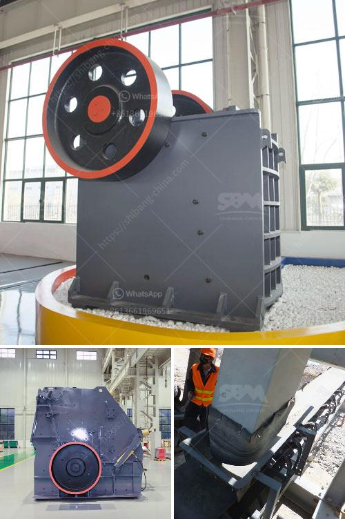

<h3>aggregate jaw crusher price</h3>
Aggregate jaw crusher is specially designed for the hardest stones and materials. It is used for the crushing of construction materials, including concrete, asphalt, and gravel. This type of crusher has a high capacity of up to 55-1200 tons per hour. It has a reliable structure, which ensures the minimum downtime of the machine. The aggregate jaw crusher is easy to maintain and operate, saving a lot of time and effort.

One of the main advantages of the aggregate jaw crusher is its low cost. Working along with other machines, it creates high-quality products at the lowest prices. The machine also features a simple structure, and it is easy to use and maintain. These factors contribute to its low operational costs.

Another significant advantage is its versatility. The aggregate jaw crusher is suitable for a wide range of applications, including mining, quarrying, and recycling. It can handle various types of materials, such as limestone, granite, and river gravel.

When it comes to the price of the aggregate jaw crusher, it is important to consider several factors. The size of the machine is one aspect that affects its cost. Different manufacturers offer jaw crushers in various sizes, ranging from small to large. The price will vary depending on the size and capacity of the machine.

The brand of the crusher is another factor to consider. There are reputable manufacturers in the market known for their quality and reliability. These brands often come with higher prices, but they offer better performance and durability. It is worth investing in a reputable brand, as it will save you money in the long run.

The location of the manufacturer also affects the price. If the manufacturer is located in a country with low production costs, the price of the aggregate jaw crusher will be lower. However, it is essential to ensure that the manufacturer meets the necessary quality standards and provides after-sales support.

In addition to the jaw crusher itself, the price may also include additional equipment or accessories. These can include a vibrating feeder, conveyor belts, or a control panel. It is advisable to compare the prices of different manufacturers and consider what is included in the package. Look for manufacturers that offer competitive prices and include the essential components.

Before purchasing an aggregate jaw crusher, it is crucial to assess your specific needs and requirements. Consider the type and size of the material you will be processing, as well as the desired output size. This information will help you choose the right machine with the appropriate capacity.

In conclusion, the aggregate jaw crusher is an essential piece of equipment for various industries. It offers several advantages, including low cost, versatility, and ease of maintenance. When considering the price, factors such as size, brand, and manufacturer's location should be taken into account. Conduct thorough research and compare prices to ensure you get the best value for your investment.
<h3>Contact us</h3><ul><li><strong>Whatsapp:&nbsp;<a href="https://wa.me/8613661969651">+8613661969651</a></strong></li><li><a href="https://swt.shibang-china.com/?git&amp;zhl&amp;aggregate jaw crusher price"><strong>Online Service(chat now)</strong></a></li></ul><h3>Related</h3><ul><li><a href='quartz mining equipments.md'>quartz mining equipments</a></li><li><a href='hammer mill 200 mesh.md'>hammer mill 200 mesh</a></li><li><a href='stone crushing plant manufacturers in.md'>stone crushing plant manufacturers in</a></li><li><a href='mini gold ore wash plant plans.md'>mini gold ore wash plant plans</a></li><li><a href='coal mill pulverizer.md'>coal mill pulverizer</a></li></ul>