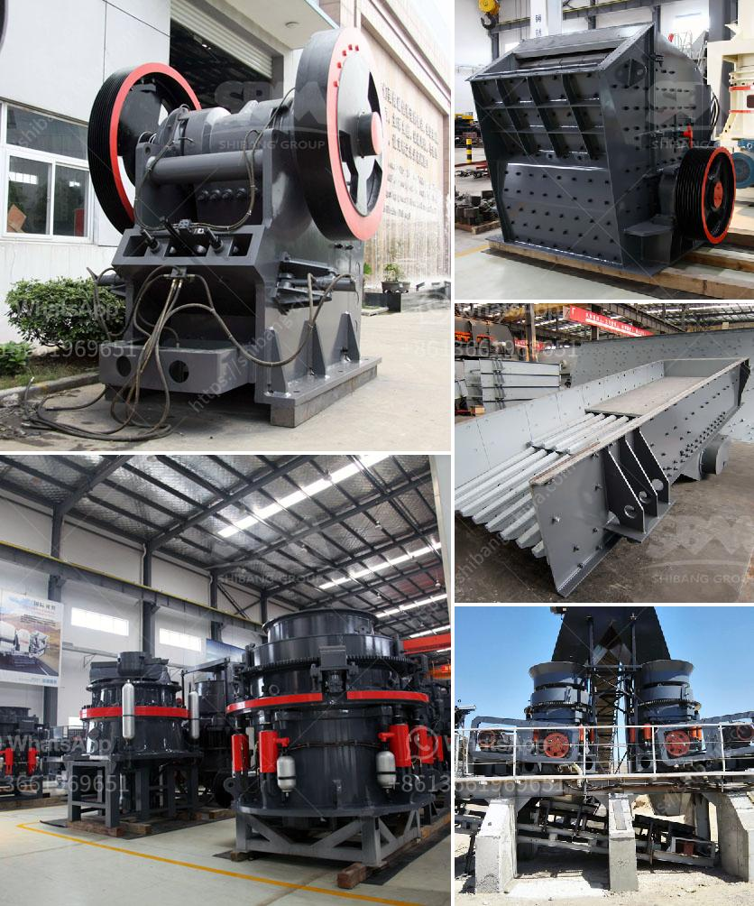

<h3>aggregate production equipment</h3>
Aggregate production equipment plays an essential role in the construction industry. They provide the necessary materials needed for building homes, roads, bridges, and other infrastructure projects. With the growing demand for construction materials, it is crucial to have reliable and efficient equipment to meet the production requirements.

Aggregate production equipment encompasses several machines and systems, which work together to provide a seamless production process. These include crushers, screens, conveyors, feeders, washers, and storage bins. Each machine performs a specific task in the production cycle, contributing to the overall efficiency and quality of the end product.

One of the primary machines used in aggregate production is the crusher. Crushing equipment breaks down large rocks into smaller pieces, making them suitable for further processing. There are different types of crushers available, such as jaw crushers, cone crushers, impact crushers, and vertical shaft impact crushers. These machines are designed to handle various types of materials, from hard rock to softer aggregates.

Screens are another critical component in aggregate production equipment. They are used to separate different sizes of aggregate, ensuring that only the desired sizes are sent for further processing. Vibrating screens and inclined screens are commonly used in this process, effectively sorting and classifying the aggregates according to size.

Conveyors are integral in the transportation of materials within the production facility. They are used to transfer aggregates from one machine to another, ensuring a continuous flow in the production process. Some conveyors are designed with adjustable speeds to optimize production rates, while others may have inclined or declined angles to accommodate specific site requirements.

In addition to crushers, screens, and conveyors, feeders also play a crucial role in aggregate production equipment. They are responsible for supplying a consistent and controlled feed of material to the crushers or screens. Vibrating feeders and apron feeders are commonly used in this process, ensuring that the materials are evenly distributed for efficient processing.

Washers are essential in aggregate production, particularly for materials like sand and gravel. They remove impurities and contaminants, improving the quality of the final product. Sand screws, log washers, and cyclones are commonly used in washing processes, producing clean and usable aggregates.

Storage bins are used to stockpile the processed aggregates before they are loaded and transported to their final destination. They provide a temporary storage solution, ensuring a continuous supply of materials for construction projects. Storage bins also help in organizing the aggregates, preventing mix-ups and confusion during transportation.

In conclusion, aggregate production equipment is indispensable in the construction industry. It enables the efficient processing of various types of materials, resulting in high-quality aggregates for construction projects. Crushers, screens, conveyors, feeders, washers, and storage bins are among the essential machines in aggregate production. Investing in reliable equipment ensures a smooth and productive production process, contributing to the overall success of construction projects.
<h3>Contact us</h3><ul><li><strong>Whatsapp:&nbsp;<a href="https://wa.me/8613661969651">+8613661969651</a></strong></li><li><a href="https://swt.shibang-china.com/?git&amp;zhl&amp;aggregate production equipment"><strong>Online Service(chat now)</strong></a></li></ul><h3>Related</h3><ul><li><a href='mobile used crushing and screening plant for sale.md'>mobile used crushing and screening plant for sale</a></li><li><a href='diamond mining equipment and pictures.md'>diamond mining equipment and pictures</a></li><li><a href='calcite crusher machine.md'>calcite crusher machine</a></li><li><a href='mobile crusher  china.md'>mobile crusher - china</a></li><li><a href='track mounted mobile crusher plant.md'>track mounted mobile crusher plant</a></li></ul>