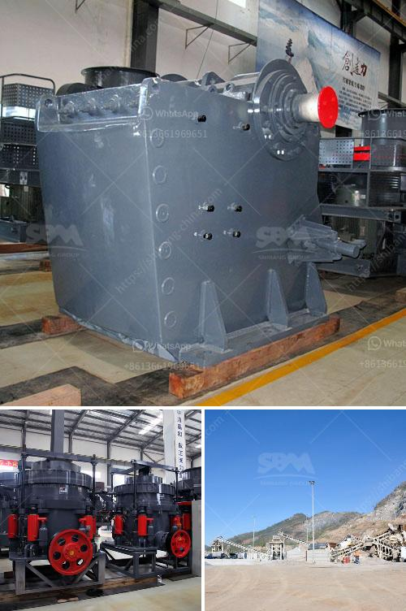

<h3>aggregate washing plant price</h3>
When it comes to the construction industry, one of the essential equipment used is an aggregate washing plant. This plant is responsible for cleaning and sorting sand, gravel, and crushed stone, ensuring that the final product meets the required specifications.

Purchasing an aggregate washing plant for your construction project is a significant investment. Therefore, understanding the factors influencing its price is crucial. Several factors contribute to the overall price of an aggregate washing plant.

First and foremost, the capacity of the plant will play a major role in determining its price. A higher capacity plant can process a larger amount of material in a shorter period. More robust and efficient plants with higher capacities tend to have higher price tags.

The second factor is the quality and performance of the plant. An aggregate washing plant equipped with advanced technologies and automation features will have a higher price compared to a basic model. However, investing in a high-quality plant ensures better performance, increased productivity, and lower maintenance costs in the long run.

The third aspect to consider is the brand reputation and reliability of the equipment manufacturer. Reputable brands are known for their reliability, quality craftsmanship, and excellent after-sales service. While the initial price may be higher for equipment manufactured by trusted brands, it is a worthwhile investment due to their longevity and efficiency.

Moreover, the location and current market conditions also play a significant role in determining the price of an aggregate washing plant. Transportation costs can vary significantly depending on the distance between the manufacturer and the construction site. Additionally, market demand and economic factors can impact the price of the plant.

Lastly, customizations and additional features can also affect the price of an aggregate washing plant. If you require specific modifications or add-ons to the plant, such as water recycling systems or dust suppression mechanisms, the price will likely increase accordingly.

Although the price of an aggregate washing plant can vary greatly depending on the aforementioned factors, it is important to focus on the long-term benefits and return on investment (ROI). A well-designed and efficient plant can significantly improve the overall efficiency of your construction project, leading to cost savings and increased profitability.

To ensure that you get the best value for your investment, it is recommended to compare prices, specifications, and after-sales services offered by different manufacturers. Seek recommendations from industry experts and consider visiting equipment exhibitions to evaluate various options.

In conclusion, purchasing an aggregate washing plant requires careful consideration of various factors that influence its price. By understanding the capacity, quality, brand reputation, market conditions, and customizations, you can make an informed decision. Ultimately, investing in a reliable and efficient plant will contribute to the success of your construction project in the long run.
<h3>Contact us</h3><ul><li><strong>Whatsapp:&nbsp;<a href="https://wa.me/8613661969651">+8613661969651</a></strong></li><li><a href="https://swt.shibang-china.com/?git&amp;zhl&amp;aggregate washing plant price"><strong>Online Service(chat now)</strong></a></li></ul><h3>Related</h3><ul><li><a href='modular jaw crusher.md'>modular jaw crusher</a></li><li><a href='coal dry processing plant.md'>coal dry processing plant</a></li><li><a href='stone crusher machine supplier.md'>stone crusher machine supplier</a></li><li><a href='ballast crusher line.md'>ballast crusher line</a></li><li><a href='gypsum board making machine supplier.md'>gypsum board making machine supplier</a></li></ul>