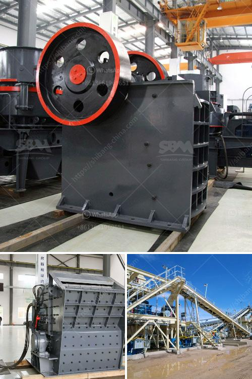

<h3>aggregate washing plant saudi arabia</h3>
The Kingdom of Saudi Arabia, located in Western Asia, is known for its vast oil reserves, natural landscapes, and rich cultural heritage. Recently, it has witnessed rapid infrastructure development projects, including the construction of new highways, buildings, and airports. As a result, the demand for high-quality aggregate materials has considerably increased in the country. To cater to this demand, several companies have established aggregate washing plants in Saudi Arabia to ensure the production of clean and well-graded aggregates.

An aggregate washing plant is a processing facility where aggregate materials such as sand, gravel, and crushed stone are washed to remove impurities such as clay, silt, and excessive fines. This process ensures that the final product is clean, free from debris, and suitable for use in various construction applications. The utilization of such plants has become crucial in Saudi Arabia to maintain the country's construction momentum.

One of the leading players in the aggregate washing plant market in Saudi Arabia is CDE, a global leader in wet processing technologies. The company has deployed its advanced washing solutions across the world and has a significant presence in Saudi Arabia. CDE's aggregate washing plants are equipped with its patented hydrocyclone technology, which efficiently removes contaminants and classified fines, ensuring the production of high-quality aggregate materials.

The aggregate washing plants in Saudi Arabia provided by CDE are customized according to aggregate types, end-product specifications, and specific client requirements. CDE's engineering team works closely with the clients to design the most efficient and cost-effective plants that maximize the production and minimize the environmental impact. The plants are designed with modules that can be easily upgraded or expanded to accommodate future growth or changing specifications.

The aggregate washing plants in Saudi Arabia are equipped with advanced automation systems, which ensure efficient operation and reduce labor requirements. The automation systems also allow the plants to be remotely monitored and controlled, minimizing downtime and optimizing performance. Additionally, the plants are equipped with water recycling systems that minimize water consumption and comply with local environmental regulations.

By using aggregate washing plants, Saudi Arabia can produce high-quality aggregates that meet international standards. These aggregates can be used in a variety of construction applications, including concrete production, road construction, and building foundations. The use of clean aggregates improves the durability and longevity of structures, reducing maintenance costs in the long run.

Moreover, the establishment of aggregate washing plants in Saudi Arabia has created job opportunities for local residents. These plants require a skilled workforce to operate and maintain them, contributing to the country's economic growth and development. Additionally, the plants indirectly support other industries such as transportation, mining, and equipment manufacturing.

In conclusion, the establishment of aggregate washing plants in Saudi Arabia has played a vital role in meeting the country's growing demand for high-quality aggregates. These plants, equipped with advanced technologies, ensure the production of clean and well-graded materials suitable for various construction applications. With the support of companies like CDE, Saudi Arabia can continue its rapid infrastructure development, creating a sustainable future for the kingdom.
<h3>Contact us</h3><ul><li><strong>Whatsapp:&nbsp;<a href="https://wa.me/8613661969651">+8613661969651</a></strong></li><li><a href="https://swt.shibang-china.com/?git&amp;zhl&amp;aggregate washing plant saudi arabia"><strong>Online Service(chat now)</strong></a></li></ul><h3>Related</h3><ul><li><a href='how to calculate the cost of returns.md'>how to calculate the cost of returns</a></li><li><a href='cost of cement manufacturing machine china.md'>cost of cement manufacturing machine china</a></li><li><a href='chain conveyors crushers.md'>chain conveyors crushers</a></li><li><a href='crusher dust washing machines.md'>crusher dust washing machines</a></li><li><a href='jaw crusher with production capacity of ton hr.md'>jaw crusher with production capacity of ton hr</a></li></ul>