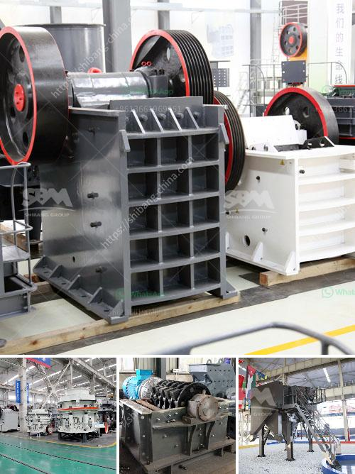

<h3>aggregates crusher plants in malaysia</h3>
Aggregates, or crushed stones, are essential for construction projects of all sizes in Malaysia. Today, in the era of technology, these aggregates are processed and optimized using advanced crusher plants. A rising demand for crushed stone in the construction industry has prompted a resurgence in overall aggregate demand in Malaysia.

Efficient crushing and screening processes help produce quality products, Mike Woof reports. Having an efficient crushing and screening operation is crucial to the cost-effectiveness of a quarry as well as providing the best quality product. The crushing circuit is a key component in any quarry with the right selection of equipment as well as effective maintenance important factors in optimizing performance. 

Crusher plants in Malaysia utilize rotating blades to crush and break down the raw material into smaller, more manageable pieces. Through impact crushing, they reduce the size of the material to facilitate easy transport and further processing. Designed to reduce the size of large rocks, these crushing plants can handle rocks of various sizes and compositions, from limestone to basalt, and from sticky clay to hard shale.

The crushing systems equipped with the latest automation technology make traveling long distances and transporting materials an easy task, saving considerable time and money. Investing in an advanced crusher plant automation system maximizes productivity while minimizing maintenance costs and plant downtime.

Furthermore, the use of crushers ensures an environmentally friendly approach to waste management. Crusher plants are designed to turn all kinds of waste stone into aggregates. With the crushing equipment's advanced automation system, unwanted material can be removed by selecting the desired size fractions or using a metal detector to purge any metallic impurities.

Overall, crusher plants in Malaysia have benefitted various projects and industries. The advancements in these plants ensure that they are equipped with the latest technology and are able to deliver the desired outputs. With the increasing demands of construction, in the country, the use of crusher plants is inevitable to cater to the ever-rising demand.
<h3>Contact us</h3><ul><li><strong>Whatsapp:&nbsp;<a href="https://wa.me/8613661969651">+8613661969651</a></strong></li><li><a href="https://swt.shibang-china.com/?git&amp;zhl&amp;aggregates crusher plants in malaysia"><strong>Online Service(chat now)</strong></a></li></ul><h3>Related</h3><ul><li><a href='cement factory sale in tamilnadu.md'>cement factory sale in tamilnadu</a></li><li><a href='harga mesin pemecah batu kapasitas satu ton.md'>harga mesin pemecah batu kapasitas satu ton</a></li><li><a href='cost of building calcium carbonate factory.md'>cost of building calcium carbonate factory</a></li><li><a href='ball mill education.md'>ball mill education</a></li><li><a href='jaw crusher price 200mm.md'>jaw crusher price 200mm</a></li></ul>