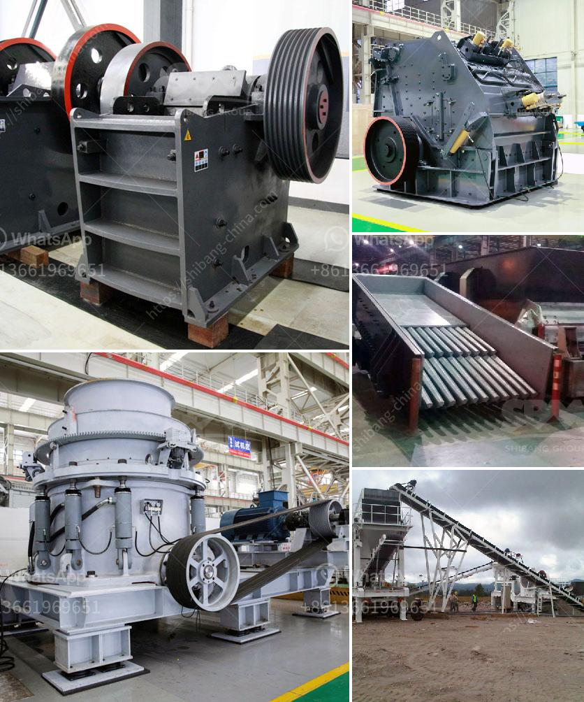

<h3>alluvial diamond processing plant cost</h3>
Alluvial diamond processing plants are an integral part of the diamond mining industry. These plants are specifically designed to extract diamonds from the alluvial deposits found in riverbeds, coastal areas, and floodplains. The alluvial diamond processing plant cost is dependent on various factors, including the size, capacity, and level of automation.

The size and capacity of the processing plant play a significant role in determining the cost. Larger plants with higher processing capacities require more equipment, infrastructure, and resources, leading to higher investment and operating costs. However, these plants can handle a larger volume of material, increasing the chances of finding more diamonds.

Another factor that influences the alluvial diamond processing plant cost is the level of automation. Depending on the technology employed, processing plants can range from manual labor-intensive operations to highly automated systems. Automated plants generally have higher upfront costs due to the investment in advanced equipment and technology. However, they offer greater efficiency, increased productivity, and reduced labor costs in the long run.

Other expenses that contribute to the cost of alluvial diamond processing plants include site preparation, infrastructure development, and ongoing maintenance. These costs can vary depending on the location of the plant, accessibility to water sources, electricity availability, and local labor costs.

It is important to note that while the alluvial diamond processing plant cost may seem substantial, it is a necessary investment for the diamond mining industry. These processing plants ensure the efficient recovery of diamonds and contribute to the overall sustainability and profitability of the mining operation.

In conclusion, the cost of setting up and operating an alluvial diamond processing plant depends on various factors such as size, capacity, automation level, and site conditions. While the initial investment may be significant, these plants are vital for the extraction and recovery of diamonds, ultimately contributing to the success of the diamond mining industry.
<h3>Contact us</h3><ul><li><strong>Whatsapp:&nbsp;<a href="https://wa.me/8613661969651">+8613661969651</a></strong></li><li><a href="https://swt.shibang-china.com/?git&amp;zhl&amp;alluvial diamond processing plant cost"><strong>Online Service(chat now)</strong></a></li></ul><h3>Related</h3><ul><li><a href='conveyor belts supplier malaysia.md'>conveyor belts supplier malaysia</a></li><li><a href='crusher machine saudi arabia.md'>crusher machine saudi arabia</a></li><li><a href='jaw crushers impact.md'>jaw crushers impact</a></li><li><a href='how to start stone crusher project.md'>how to start stone crusher project</a></li><li><a href='estimated budget for a conveyor belt.md'>estimated budget for a conveyor belt</a></li></ul>