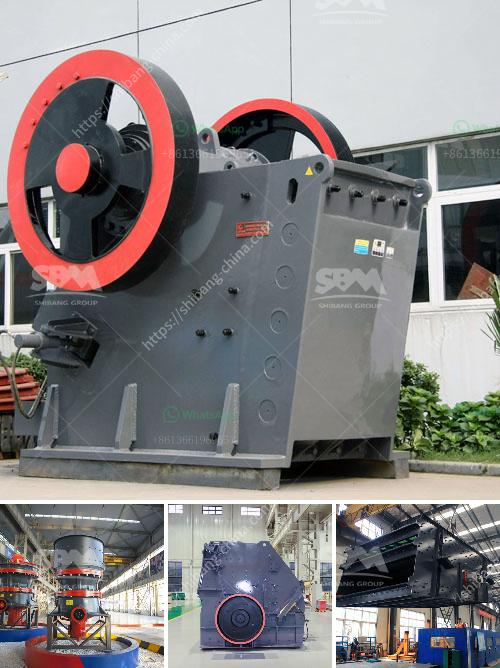

<h3>alluvial gold mining process</h3>
Alluvial gold mining is a type of placer mining that involves extracting gold from loose gravel deposits that result from the erosion of gold-bearing rocks. This type of mining is different from traditional mining approaches in that there is no need for extensive infrastructure or heavy machinery to excavate and process the ore.

The process of alluvial gold mining involves washing and sifting through gravel to separate gold flakes and nuggets from the other materials. Gold panning is the most common method used by small-scale prospectors, but larger mining equipment like gold dredges, sluice boxes, and even highbankers can be utilized for excavating and processing large amounts of gravel.

The gold-bearing gravel is first hauled out of the ground using shovels or backhoes. The gravel is then washed to separate the lighter material, such as sand and clay, from the heavier gold nuggets and flakes. The sediment-water mixture is poured into a pan, and with a swirling motion, the lighter materials are washed out, leaving behind the valuable gold.

In larger-scale operations, a sluice box or a highbanker is used to efficiently process larger amounts of gravel. A sluice box is a long, narrow channel with riffles or grooves that trap the gold as water flows through. The gravel is fed into the upper end of the sluice box, while water is pumped through the channel. The heavier gold particles get caught in the riffles, while the lighter materials wash away.

Alluvial gold mining is often considered as a relatively low-cost and environmentally friendly method of extracting gold. Since valuable gold deposits are often found in riverbeds or floodplains, these areas can be easily accessed and the mining operation does not require extensive digging or blasting. However, it is important to implement responsible mining practices to minimize the impact on the environment and local communities.

Overall, alluvial gold mining is a straightforward and efficient process that offers opportunities for individuals or small-scale mining operations to recover gold in easily accessible areas. With the use of simple equipment like sluice boxes or gold pans, it is possible to recover significant amounts of gold from alluvial deposits.
<h3>Contact us</h3><ul><li><strong>Whatsapp:&nbsp;<a href="https://wa.me/8613661969651">+8613661969651</a></strong></li><li><a href="https://swt.shibang-china.com/?git&amp;zhl&amp;alluvial gold mining process"><strong>Online Service(chat now)</strong></a></li></ul><h3>Related</h3><ul><li><a href='course in maintenance of stone crushers.md'>course in maintenance of stone crushers</a></li><li><a href='by products of limestone processing.md'>by products of limestone processing</a></li><li><a href='grinding equipment raymond mill.md'>grinding equipment raymond mill</a></li><li><a href='ball mill specification limestone grinding.md'>ball mill specification limestone grinding</a></li><li><a href='gold recovery equipment for small mining companies.md'>gold recovery equipment for small mining companies</a></li></ul>