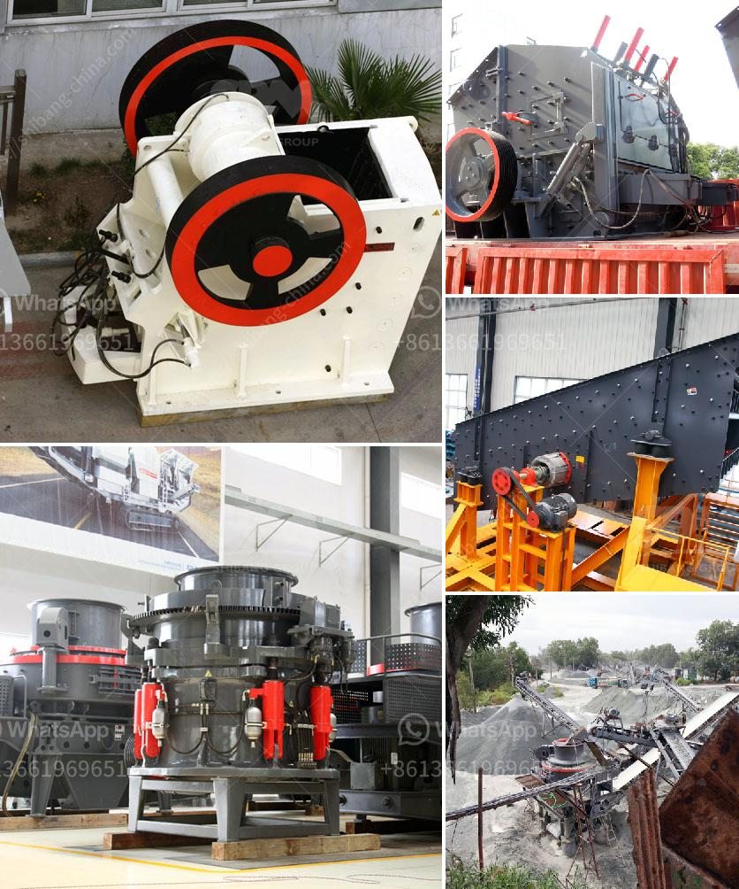

<h3>alluvial gold plants for sale south africa</h3>
Alluvial gold plants for sale South Africa is renowned for its abundance of gold deposits, making it a leading destination for alluvial gold mining in Africa. It is also a popular location for gold mining machinery and equipment auctions as related companies prepare to liquidate their assets.

One of the first stops for prospectors in South Africa is the alluvial gold fields in the Eastern side of the country. These fields are home to some of the world's largest gold nuggets and have been a significant source of gold throughout history.

Alluvial gold refers to gold that has been washed away from its original deposit by the action of water. Over time, the rivers and streams in South Africa have eroded the rock and soil, leaving behind gold particles. These particles can range in size from tiny specks to larger nuggets.

To extract the gold from alluvial deposits, specialized plants and equipment are required. These alluvial gold plants for sale in South Africa are designed to easily extract the gold from the ore and provide customers with an easy way to get their desired end product.

An alluvial gold plant consists of several components that include a vibrating feeder, jaw crusher, cone crusher, vibrating screen, and an ore sizing screen. The ore is initially crushed and screened. The oversized material is then passed through a cone crusher and re-crushed. The undersized material is sent to a vibrating screen, where it is screened further to achieve the desired particle size.

Once the material has been properly sized, it is then fed into a gold recovery system. This system typically consists of a series of sluice boxes, jigs, or shaking tables, depending on the size and type of alluvial deposit being mined. These machines use water and gravity to separate the gold from the other materials.

The final step in the process is the collection of the gold concentrate, which can be further refined using various methods such as smelting or chemical processes to produce high-purity gold.

Several companies in South Africa offer alluvial gold plants for sale, making it convenient for prospectors and small-scale miners to acquire the necessary equipment for their operations. These plants vary in size and capacity, with options available for both large-scale commercial mining operations and smaller, more artisanal mining ventures.

Additionally, many of these companies also offer consulting services and technical support, ensuring that customers have the necessary knowledge and guidance to successfully operate their alluvial gold plants.

In conclusion, South Africa is a highly desirable location for alluvial gold mining due to its rich deposits and historical significance in the gold mining industry. The availability of alluvial gold plants for sale further supports the country's reputation as a leading destination for gold mining. Whether for large-scale operations or smaller-scale ventures, there are options available to suit various needs and budgets.
<h3>Contact us</h3><ul><li><strong>Whatsapp:&nbsp;<a href="https://wa.me/8613661969651">+8613661969651</a></strong></li><li><a href="https://swt.shibang-china.com/?git&amp;zhl&amp;alluvial gold plants for sale south africa"><strong>Online Service(chat now)</strong></a></li></ul><h3>Related</h3><ul><li><a href='silica water washing plant manufacturers in india.md'>silica water washing plant manufacturers in india</a></li><li><a href='crushing companies in the usa.md'>crushing companies in the usa</a></li><li><a href='ball milling grinding machine in namibia.md'>ball milling grinding machine in namibia</a></li><li><a href='raymond grinding mill machine.md'>raymond grinding mill machine</a></li><li><a href='limestone crusher machine limus.md'>limestone crusher machine limus</a></li></ul>