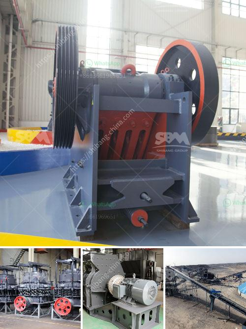

<h3>apline ball mill pakistan</h3>
The Alpine Ball Mill is a versatile piece of machinery that can easily grind and homogenize various types of raw materials. This machine is widely used in mineral processing, building materials, metallurgy, chemistry, and other industries. It is especially suitable for materials with Mohs hardness under 6.

The Alpine Ball Mill works by continuously rotating a cylinder with grinding balls, which grinds the material inside. The rotating motion of the ball mill barrel creates centrifugal force, causing the grinding balls to fall back into the cylinder and onto the material to be ground. The rotation is usually between 4 to 20 revolutions per minute, depending on the diameter of the mill.

One of the key advantages of the Alpine Ball Mill is its low energy consumption. This machine operates well even in low-speed conditions, resulting in reduced energy consumption and operational costs. It also ensures a high grinding efficiency and good product quality.

The Alpine Ball Mill is available in different types, including the standard parallel shaft gearbox model and the novel –central driven model. Both models are especially designed for blending, mixing, dispersing, and nano-sizing of various materials. These machines can effectively grind powders of different hardness levels, ensuring a uniform particle size distribution.

In Pakistan, the Alpine Ball Mill has become a popular industrial tool that is used to grind a variety of minerals and other materials. Due to its diverse range of applications, the Alpine Ball Mill is highly in demand in the market. The machine is available in different sizes, allowing customers to choose the most suitable one according to their specific requirements.

Overall, the Alpine Ball Mill is a reliable grinding solution that can be used for a wide range of applications. Its low energy consumption and high grinding efficiency make it a cost-effective option for many industries in Pakistan and beyond. Whether it's grinding minerals or blending materials, the Alpine Ball Mill delivers exceptional performance and consistent results.
<h3>Contact us</h3><ul><li><strong>Whatsapp:&nbsp;<a href="https://wa.me/8613661969651">+8613661969651</a></strong></li><li><a href="https://swt.shibang-china.com/?git&amp;zhl&amp;apline ball mill pakistan"><strong>Online Service(chat now)</strong></a></li></ul><h3>Related</h3><ul><li><a href='nigeria cone crusher.md'>nigeria cone crusher</a></li><li><a href='gravel conveyor belt.md'>gravel conveyor belt</a></li><li><a href='copper ore processing plant kenya.md'>copper ore processing plant kenya</a></li><li><a href='raymond grinding mill for sale in thailand.md'>raymond grinding mill for sale in thailand</a></li><li><a href='crushing plants business machinery and construction.md'>crushing plants business machinery and construction</a></li></ul>