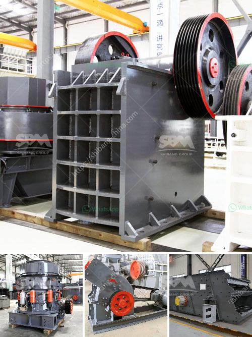

<h3>application of ball mill in industries</h3>
The ball mill is a key equipment extensively used for grinding crushed materials in production lines for powders such as cement, fertilizer, refractory material, silicates, glass ceramics as well as for ore dressing of both, black and non-ferrous metals. The ball mill can grind various ores and other materials either wet or dry. 

There are two kinds of ball mills, grate type and overfall type due to different ways of discharging material. Ball mill has a wide range of applications, particularly in mining industry and metallurgy industry. 

The ball mill is used for grinding materials such as coal, pigments, and feldspar for pottery. Grinding can be carried out either wet or dry but the former is performed at low speed. For systems with multiple components, ball milling has been shown to be effective in increasing solid-state chemical reactivity. Additionally, ball milling has been shown to be helpful in increasing the amorphization rate of poorly crystalline powders obtained from cryogenic grinding.

The ball mill consists of a hollow cylindrical shell that rotates around its axis. It is partially filled with balls that can be made of stainless steel, ceramic, metal, or rubber. The inner part of the shell is usually lined with an abrasion-resistant material such as manganese steel or rubber. For many years, Hardox steel has been considered the standard for lining material. However, in recent times, the installation of high-density alumina lining bricks has gained broader acceptance. These bricks have successfully reduced the overall maintenance and wear within the ball mill.

Ball mill operation is often regarded as something of a mystery for several reasons. Ball milling is not an art - it's just physics. The first problem will ball mills is that we cannot see what is occurring in the mill. The other problem is that many of the independent variables are non-linear or have paradoxical effects on the end results. In a ball mill circuit, the output can be defined as the production rate of fines of the circuit. As for any output, ball mill circuit output is a function of both its inputs and efficiencies.

There are two main types of ball mill drives. Gear drive and electrical drive. Gear-driven ball mill is more common in the mechanical alloying process and other milling applications. Electrical drive is typical for modern mills and it can be operated by fields between 500 to 5000V. 

Ball mills have a number of advantages for milling solids either wet or dry. In order to minimize product contamination, ball mills can be constructed with a wide range of materials, including abrasion-resistant high-chrome steel, alumina brick, and cast polyurethane. Because all the energy generated by the mill is put into the grinding process, cooling jackets are furnished on mills for heat sensitive materials to control temperature. 

In conclusion, ball mill is a very valuable machine for a wide range of industries which offers high grinding efficiency, low power consumption, and consistent size reduction. By controlling the process variables inside the mill, it is possible to achieve the desired material size and optimize the production rate. Therefore, ball mills are extensively used in the mining, construction, chemical, metallurgy, and agriculture industries.
<h3>Contact us</h3><ul><li><strong>Whatsapp:&nbsp;<a href="https://wa.me/8613661969651">+8613661969651</a></strong></li><li><a href="https://swt.shibang-china.com/?git&amp;zhl&amp;application of ball mill in industries"><strong>Online Service(chat now)</strong></a></li></ul><h3>Related</h3><ul><li><a href='processing of cement crusher.md'>processing of cement crusher</a></li><li><a href='quartz plant and machinary.md'>quartz plant and machinary</a></li><li><a href='price of rollers for conveyor belts.md'>price of rollers for conveyor belts</a></li><li><a href='cutting milling machine for marble and granite.md'>cutting milling machine for marble and granite</a></li><li><a href='price for mobile stone crushers in japan.md'>price for mobile stone crushers in japan</a></li></ul>