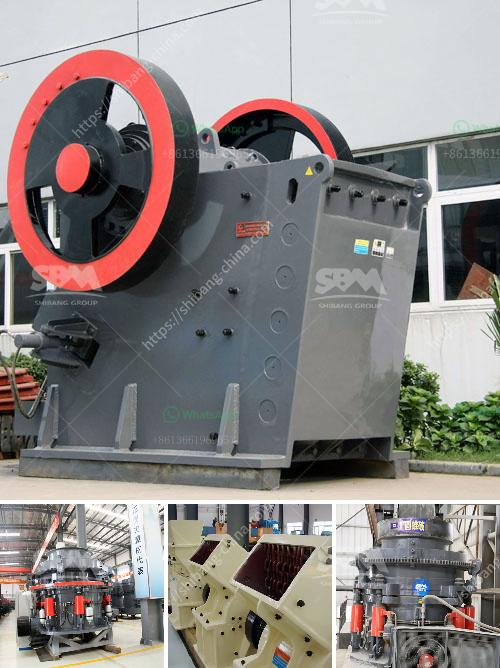

<h3>artificial sand project</h3>
Artificial sand is the imitation of natural sand, also known as manufactured sand or crushed sand. It is an important material in the construction industry, as it provides the perfect substitute for natural sand.

The rapid depletion of natural sand resources is causing environmental concerns, as the extraction of sand from rivers and beaches can cause irreparable damage to ecosystems. Additionally, the increased demand for sand in the construction industry has led to skyrocketing prices, making it unaffordable for many projects.

To address these issues, the artificial sand project emerged as a viable solution. This involves crushing rocks or stones to create coarse and fine aggregates, which can be used in various construction applications. Advanced technology and innovative techniques are used to produce high-quality artificial sand that closely resembles the properties of natural sand.

One of the major advantages of artificial sand is its consistent quality. Unlike natural sand, which can vary in composition and texture, artificial sand can be precisely manufactured to meet specific requirements. This ensures a more reliable and uniform material for construction purposes.

Furthermore, the use of artificial sand reduces the need for river sand mining, which preserves the fragile ecosystems of rivers and beaches. By utilizing artificial sand, we can protect our environment and maintain the balance of nature.

The artificial sand project also helps to address the affordability issue. With its abundant availability and controlled production process, artificial sand can be produced at a lower cost, making it a cost-effective alternative for various construction projects.

Overall, the artificial sand project is a game-changer in the construction industry. Its potential to conserve natural resources, protect the environment, and provide a reliable and affordable alternative to natural sand is commendable. With ongoing advancements and research, the future of artificial sand looks promising, contributing to a sustainable and eco-friendly construction sector.
<h3>Contact us</h3><ul><li><strong>Whatsapp:&nbsp;<a href="https://wa.me/8613661969651">+8613661969651</a></strong></li><li><a href="https://swt.shibang-china.com/?git&amp;zhl&amp;artificial sand project"><strong>Online Service(chat now)</strong></a></li></ul><h3>Related</h3><ul><li><a href='best prices for portable impact crushers.md'>best prices for portable impact crushers</a></li><li><a href='roller crusher in egypt.md'>roller crusher in egypt</a></li><li><a href='ball mill pulverizer.md'>ball mill pulverizer</a></li><li><a href='copper concentrate ball mill for sale.md'>copper concentrate ball mill for sale</a></li><li><a href='quarry of stone crusher in pakistan pdf.md'>quarry of stone crusher in pakistan pdf</a></li></ul>