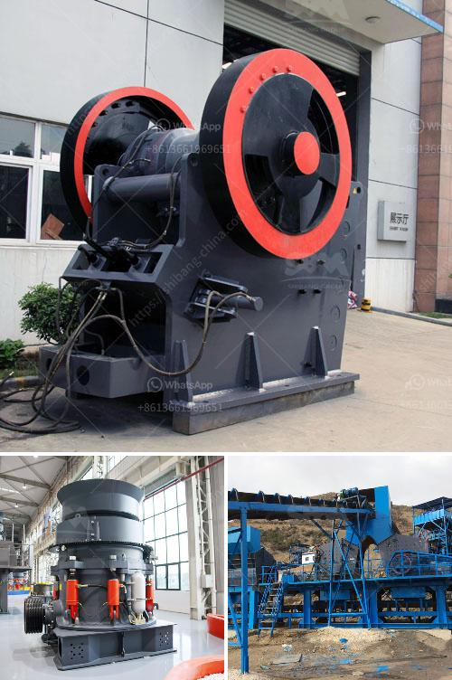

<h3>automation coal crushing and conveyor</h3>
In recent years, the mining industry has faced numerous challenges and reforms. With the increasing demand for coal, the industry has witnessed the need to optimize mining operations to ensure efficient extraction and utilization of the available resources. Automation has emerged as a crucial technological advancement in the mining sector, particularly in the coal crushing and conveyor systems.

Coal plays a vital role in the global energy mix, contributing to nearly 27% of the world’s primary energy production. However, the process of extracting coal from mines and transporting it to power plants or other industrial facilities can be arduous and costly. Traditional coal crushing and conveyor systems require multiple operators and are often labor-intensive efforts. With advancements in technology, automation has become a game-changer for the industry.

Automation in coal crushing and conveyor systems involves the use of mechanical equipment that optimizes the collection, storage, and transportation of coal. The system, controlled by a programmable logic controller (PLC), provides efficient and safe management of coal handling activities. Automated coal crushing and conveyor systems eliminate the need for manual handling and reduce the risk of accidents.

One of the benefits of automation is the consistent and uniform processing of coal. Automated coal crushing systems can control the equipment’s operation, speed, and intensity of crushing, ensuring optimal coal particle size, shape, and distribution. This consistency helps power plants and other industrial facilities achieve better combustion efficiency and reduce emissions. Moreover, automated systems can continuously monitor coal quality and adjust the crushing process accordingly, leading to enhanced coal utilization.

Automation in coal crushing and conveyor systems also offers better workplace safety. The use of sensors and advanced control algorithms ensures that the crushing equipment operates within safe limits. Alarms and alerts can be set up to signal any deviations, reducing the risk of equipment failure or damage. Additionally, by eliminating the need for manual handling, automation eliminates the risk of injuries caused by workers’ exposure to potentially hazardous conditions.

Furthermore, automation in coal crushing and conveyor systems presents economic advantages. By reducing the need for manual labor, mining companies can save on labor costs. Additionally, automated systems can operate continuously and consistently, thereby increasing the productivity of coal crushing activities. The optimized efficiency of automation enables mining companies to extract more coal in a shorter time, leading to increased profitability.

While there are numerous advantages to automation in coal crushing and conveyor systems, it is essential to consider potential challenges. Implementing automation requires substantial investment in equipment, installation, and training. Furthermore, regular maintenance and upgrades are necessary to ensure uninterrupted operation and optimize performance. Overcoming these challenges requires mining companies to carefully plan and strategize their automation initiatives.

In conclusion, automation in coal crushing and conveyor systems marks a remarkable shift in the mining industry. By eliminating manual labor, reducing accidents, improving coal quality, and increasing productivity, automation offers numerous benefits to mining companies. However, successful implementation requires thoughtful planning, investment, and ongoing maintenance. As the need for clean and efficient energy continues to grow, automation will remain a critical driver for the coal mining industry’s sustainable future.
<h3>Contact us</h3><ul><li><strong>Whatsapp:&nbsp;<a href="https://wa.me/8613661969651">+8613661969651</a></strong></li><li><a href="https://swt.shibang-china.com/?git&amp;zhl&amp;automation coal crushing and conveyor"><strong>Online Service(chat now)</strong></a></li></ul><h3>Related</h3><ul><li><a href='stone crusher plant brochure.md'>stone crusher plant brochure</a></li><li><a href='company that sells vibratory sieves in spain.md'>company that sells vibratory sieves in spain</a></li><li><a href='50tph stone crusher in germany.md'>50tph stone crusher in germany</a></li><li><a href='types of grinding mill.md'>types of grinding mill</a></li><li><a href='two roll mill supply in sri lanka.md'>two roll mill supply in sri lanka</a></li></ul>