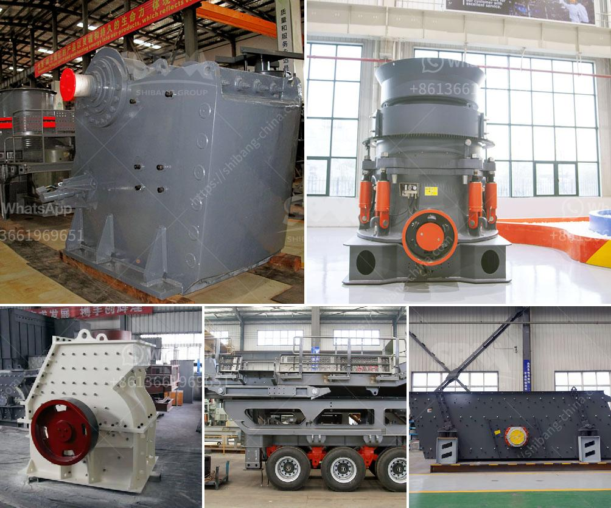

<h3>ball mill capacity 26 x 41</h3>
The ball mill is a key equipment in grinding operations. Designed to pulverize materials, its capacity depends on the specific application and materials being processed. A ball mill with a larger capacity, also known as a tube mill, is usually divided into several chambers, with different sizes of grinding media.

The chamber containing heavier balls is responsible for grinding coarse particles, while the chamber with smaller balls ensures fine grinding. The length-to-diameter ratio of the mill can vary, but generally ranges from 1:1 to 3:1, providing a larger surface area for the grinding media to make contact with the material being processed.

A ball mill with a capacity of 26 x 41 ft or 7.9 x 12.5 meters and designed for 27,000 HP (20,000 kW) motors, is considered to be the largest mill in the world. This massive mill is equipped with two 5500 kW (7,500 HP) motors and operates with a ball charge of approximately 25-28%.

The ball mill's capacity can vary significantly depending on the material being processed, feed size, and discharge system. To achieve optimal capacity, it's important to regularly monitor and optimize the ball mill's performance through both continuous and periodic inspections.

Increasing the mill's capacity can be achieved by increasing the circulating load, optimizing the ball charge composition, adjusting the mill's speed, or upgrading the liners. However, it's crucial to ensure that such modifications are carefully evaluated to prevent compromising the mill's performance and reliability.

The ball mill's capacity of 26 x 41 ft is often used in large-scale mining operations, cement plants, and other industrial applications. It offers efficient grinding and can produce a wide range of particle sizes, making it a versatile and widely-used equipment in the mineral processing industry.

Overall, the ball mill's capacity of 26 x 41 ft, combined with its robust design and reliable performance, makes it a trusted choice for many industries requiring efficient size reduction.
<h3>Contact us</h3><ul><li><strong>Whatsapp:&nbsp;<a href="https://wa.me/8613661969651">+8613661969651</a></strong></li><li><a href="https://swt.shibang-china.com/?git&amp;zhl&amp;ball mill capacity 26 x 41"><strong>Online Service(chat now)</strong></a></li></ul><h3>Related</h3><ul><li><a href='ball mill drive system.md'>ball mill drive system</a></li><li><a href='copper ore ball mill.md'>copper ore ball mill</a></li><li><a href='capital cost gold processing plant.md'>capital cost gold processing plant</a></li><li><a href='cement plant machinery list.md'>cement plant machinery list</a></li><li><a href='mobile recycle crushing.md'>mobile recycle crushing</a></li></ul>