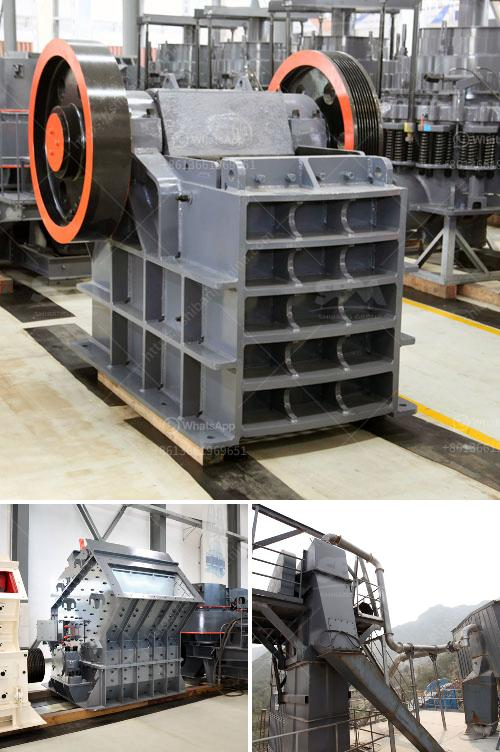

<h3>ball mill capacity</h3>
Ball mill capacity is an important parameter in the process of ball mill selection. The ball mill is a highly efficient grinding equipment for grinding crushed materials. It is widely used in cement, silicate, refractory materials, fertilizer, black and non-ferrous metal processing and glass ceramics and other production industries, with a variety of ores, slag and other materials for dry or wet grinding.

The capacity of the ball mill directly affects the grinding efficiency and economic benefits of the grinding process. Therefore, it is very important to evaluate the capacity of the ball mill.

1. The nature of materials: Different materials have different properties, and their hardness, particle size, humidity, etc. will have a certain impact on the production capacity of the ball mill. Generally, materials with harder and larger particle sizes require higher crushing size requirements, which means that the ball mill needs to be equipped with a more powerful crushing system to ensure that the materials are fully crushed before entering the ball mill, thereby effectively improving the production capacity.

2. The specifications of the ball mill itself: The size of the ball mill determines the amount of material that can be ground at a certain time. As the size of the ball mill increases, the capacity of the ball mill will increase accordingly. For example, a ball mill with a larger diameter can increase the filling rate of the steel balls, thereby increasing the grinding area of the materials and improving the grinding efficiency.

3. The speed of the ball mill: The rotation speed of the ball mill directly affects the movement state of the steel balls and the grinding process of the materials. With the increase of the rotation speed, the centrifugal force generated by the steel balls will also increase, which will promote the grinding of the materials. However, there is an optimal speed for the ball mill, exceeding which will cause the materials to be ground too finely or even agglomerate, affecting the production capacity.

4. The filling rate of the steel balls: The filling rate of the steel balls in the ball mill also plays an important role in determining the capacity of the ball mill. When the filling rate is too low, the impact ability of the steel balls on the materials will be reduced, resulting in insufficient grinding and low production capacity. Conversely, if the filling rate is too high, there will be too many steel balls in the ball mill, occupying the space that should be filled with materials, affecting the normal circulation of materials and reducing the total volume of the grinding zone, resulting in reduced production capacity.

In conclusion, the capacity of the ball mill is affected by various factors, including the nature of the materials, the specifications of the ball mill, the speed of the ball mill, and the filling rate of the steel balls. It is necessary to comprehensively consider these factors when selecting a ball mill to ensure the stable and efficient operation of the equipment and maximize the production capacity.
<h3>Contact us</h3><ul><li><strong>Whatsapp:&nbsp;<a href="https://wa.me/8613661969651">+8613661969651</a></strong></li><li><a href="https://swt.shibang-china.com/?git&amp;zhl&amp;ball mill capacity"><strong>Online Service(chat now)</strong></a></li></ul><h3>Related</h3><ul><li><a href='bentonite production process.md'>bentonite production process</a></li><li><a href='controlling parameter of impact crusher.md'>controlling parameter of impact crusher</a></li><li><a href='quotes hammer mill.md'>quotes hammer mill</a></li><li><a href='the company mines limestone in ethiopia.md'>the company mines limestone in ethiopia</a></li><li><a href='rubber belt conveyor for sale.md'>rubber belt conveyor for sale</a></li></ul>