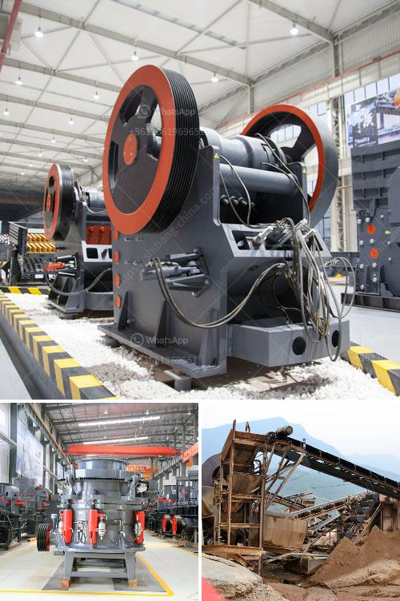

<h3>ball mill drive system</h3>
Ball mill drive systems are widely used in mining, cement plants, power generation and other industries to grind and crush various materials. The ball mill drive system includes motor, reducer, ring gear, pinion gear and roller gear, which ensures the stable operation of the ball mill.

The motor drives the pinion gear to rotate, which then engages with the ring gear and rotates the ball mill. The pinion gear is driven by the motor through the reducer, and the roller gear on the toothed coupling drives the ball mill roller to rotate. As the roller rotates, its large inertia and centrifugal force cause a certain impact on the grinding body, leading to the rotation of the ball mill.

The drive system of the ball mill is very important as it directly affects the operational efficiency of the equipment. It is common practice to align the pinion gears of ball mills in order to optimize the transmission efficiency and reduce energy consumption. In addition, the alignment of the gears also prevents wear and tear, enhances the overall performance of the ball mill, and prolongs its service life.

Regular maintenance and lubrication of the ball mill drive system are essential to ensure its stable operation. Proper lubrication not only reduces friction and wear between the gears but also maintains the cooling effect of the system. Lubrication also prevents the gears from corroding and extends their lifespan.

In conclusion, the ball mill drive system plays a crucial role in the stable operation of the ball mill. It is responsible for the smooth transmission of mechanical power, ensuring the grinding process is efficient and reliable. By maintaining and lubricating the drive system, the ball mill can operate safely and maintain its optimal performance for a longer period of time.
<h3>Contact us</h3><ul><li><strong>Whatsapp:&nbsp;<a href="https://wa.me/8613661969651">+8613661969651</a></strong></li><li><a href="https://swt.shibang-china.com/?git&amp;zhl&amp;ball mill drive system"><strong>Online Service(chat now)</strong></a></li></ul><h3>Related</h3><ul><li><a href='powder making machine.md'>powder making machine</a></li><li><a href='gold ore 300 550tph cs cone crusher for sale.md'>gold ore 300 550tph cs cone crusher for sale</a></li><li><a href='how much does it cost to set up a mini cement plant.md'>how much does it cost to set up a mini cement plant</a></li><li><a href='mobile concrete crusher.md'>mobile concrete crusher</a></li><li><a href='copper ore ball mill torky.md'>copper ore ball mill torky</a></li></ul>