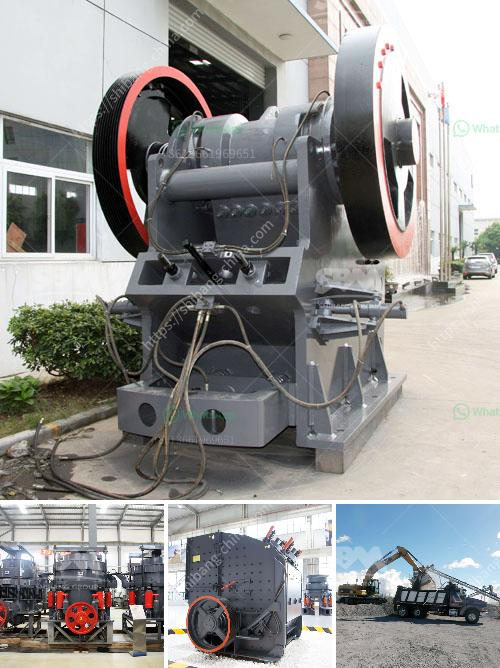

<h3>ball mill education</h3>
Ball mills are a fundamental part of the manufacturing industry in the United States as well as across the globe. Ball mills crush material into various sizes and extract resources from mined materials. Pebble mills are a type of ball mill and are also used to reduce the size of hard materials, down to 1 micron or less.

The history of ball mills started from the early 19th century when mills were moved from rotating rock cylinders to ball-shaped containers. This advancement was made possible by the invention of steam power, allowing the use of large-scale expertise in the grinding of materials.

Modern ball mills have undergone significant advancements in technology, enhancing their efficiency and overall effectiveness. These advancements have greatly improved the productivity and output of industries that rely on the use of ball mills.

One crucial aspect of ball mill education is understanding the principles of grinding. In a ball mill, particles are placed in a rotating cylindrical shell partially filled with grinding media such as balls. The materials to be ground are loaded into the shell, and as the cylinder rotates, the balls tumble onto the material, crushing and grinding it.

The choice of grinding media is vital in determining the efficiency and effectiveness of a ball mill. Different materials, sizes, and density of grinding media influence the grinding process. Ceramic balls, for example, are commonly used in industries where contamination is a concern, such as the food and pharmaceutical industries. Steel balls, on the other hand, are frequently used in the mining industry for their durability and high impact resistance.

Advancements in ball mill technology have led to the development of high-performance and energy-efficient grinding equipment. The conical ball mill, for example, has been widely used in both the mining and chemical industries. It consists of a cylinder-shaped shell supported by a conical base, with a crushing surface located near the bottom.

The conical ball mill is advantageous because it requires less floor space, can be easily transported, and has a higher grinding capacity compared to other models. Furthermore, this type of mill can operate under closed-circuit conditions, which significantly improves overall efficiency by maintaining particle size distribution.

Ball mill education also includes understanding the operating parameters that affect grinding performance. The rotational speed of the mill, the grinding media, and the feed rate are crucial factors that influence the outcome. Adjusting these parameters can optimize the mill's productivity and reduce energy consumption.

In recent years, the use of computer simulations and modeling has further enhanced ball mill education. These tools help engineers predict the behavior of a ball mill in various operating conditions, allowing them to make informed decisions regarding process optimization.

In conclusion, ball mill education plays a crucial role in the understanding and advancement of grinding technology. The continuous improvements made in ball mill design and operation have allowed industries to achieve higher productivity, reduce energy consumption, and produce high-quality products. As technology continues to evolve, so does the education surrounding ball mills, ensuring their relevance and effectiveness in various manufacturing processes.
<h3>Contact us</h3><ul><li><strong>Whatsapp:&nbsp;<a href="https://wa.me/8613661969651">+8613661969651</a></strong></li><li><a href="https://swt.shibang-china.com/?git&amp;zhl&amp;ball mill education"><strong>Online Service(chat now)</strong></a></li></ul><h3>Related</h3><ul><li><a href='ball mill unloading system in india.md'>ball mill unloading system in india</a></li><li><a href='quotation for stone crusher.md'>quotation for stone crusher</a></li><li><a href='quarry business plan.md'>quarry business plan</a></li><li><a href='business plan on manganese ore mining.md'>business plan on manganese ore mining</a></li><li><a href='vibrating screen prices.md'>vibrating screen prices</a></li></ul>