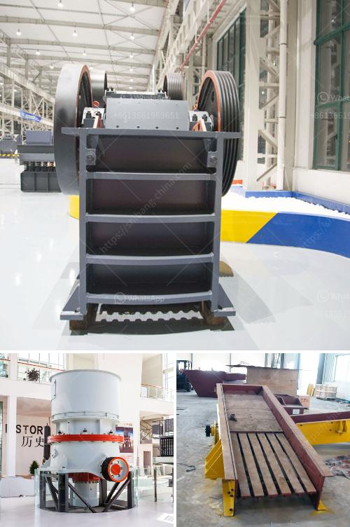

<h3>ball mill for ceramic factory</h3>
A ball mill is a type of grinder used to grind, blend, and sometimes for mixing of materials for use in mineral dressing processes, paints, pyrotechnics, ceramics, and selective laser sintering. It works on the principle of impact and attrition: size reduction is done by impact as the balls drop from near the top of the shell. A ball mill consists of a hollow cylindrical shell rotating about its axis. The axis of the shell may be either horizontal or at a small angle to the horizontal. It is partially filled with balls. The grinding media are the balls, which may be made of steel, stainless steel, ceramic, or rubber.

In a ceramic factory, grinding is an important process that consumes high energy. Due to the high cost of energy in a ceramic factory, operators are looking for energy-efficient solutions to minimize costs. To meet these demands, ceramic industries have come up with a ball mill.

The ball mill in a ceramic factory is used for grinding, mixing, and blending materials. It works on the principle of impact and attrition. The size of the balls inside the mill depends on the hardness and particle size of the material being processed. The bigger the balls, the more impact force they generate on the material, resulting in finer and more efficient grinding.

The ceramic balls used in the ball mill are often made of alumina - a high-density material known for its exceptional wear resistance. The grinding media in the ball mill also plays an important role in generating a well-milled product. In the ball mill, particles are subjected to high-energy impact and abrasion between the balls and the lining of the mill. Therefore, the material that is being ground should have sufficient hardness to resist the grinding action.

To achieve efficient grinding in a ball mill, the ceramic factory utilizes a continuous flow process. This means that the material is fed into the mill continuously and is discharged as a finished product. This requires appropriate equipment and careful monitoring of the process parameters such as the speed of the mill, the filling level, and the size of the balls.

The ball mill in a ceramic factory is an essential equipment and is made from high-quality materials. It is designed to be a long-lasting investment. When properly maintained and operated, it can offer excellent performance and energy efficiency.

In conclusion, the ball mill plays a vital role in the ceramic factory. It is used for grinding and blending materials, ensuring high-quality product output. It operates on the principle of impact and attrition, utilizing ceramic balls as the grinding media. The continuous flow process and proper maintenance contribute to efficient and cost-effective grinding operations. The ball mill in a ceramic factory serves as an essential equipment, offering durability and excellent performance.
<h3>Contact us</h3><ul><li><strong>Whatsapp:&nbsp;<a href="https://wa.me/8613661969651">+8613661969651</a></strong></li><li><a href="https://swt.shibang-china.com/?git&amp;zhl&amp;ball mill for ceramic factory"><strong>Online Service(chat now)</strong></a></li></ul><h3>Related</h3><ul><li><a href='rental crusher vertical.md'>rental crusher vertical</a></li><li><a href='crushing plants for sale in south africa.md'>crushing plants for sale in south africa</a></li><li><a href='cement plant machinery manufacturers in germany.md'>cement plant machinery manufacturers in germany</a></li><li><a href='flow chart for gold extraction from ores.md'>flow chart for gold extraction from ores</a></li><li><a href='how to decrease the dust in a crushing plant.md'>how to decrease the dust in a crushing plant</a></li></ul>