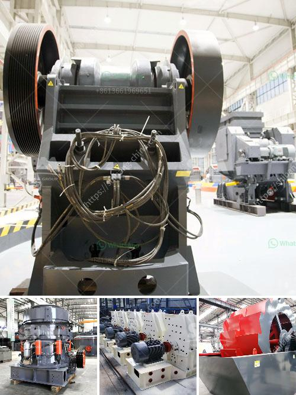

<h3>ball mill for ceramic tile factory</h3>
In the ceramic industry, the ball mill is an indispensable tool for material mixing and grinding. It is used in the production of various types of ceramic tiles, for both wall and floor applications. Through the breaking and grinding of raw materials, ceramic tile manufacturers achieve the required product quality while ensuring a high level of efficiency.

The ball mill consists of a cylindrical drum, usually made of steel, lined with ceramic tiles. The ultra-smooth inner lining ensures efficient grinding, improving the performance and longevity of the mill. The material to be ground, along with water and grinding media, is placed inside the drum, which rotates, causing the grinding media to collide and crush the materials.

One of the primary advantages of using a ball mill in a ceramic tile factory is its high productivity. With the ability to grind large quantities of raw materials continuously, manufacturers can achieve a consistent output without significant downtime. This is especially important in a ceramic tile factory, where high production demands must be met.

In addition to its productivity, the ball mill provides precise control over the grinding process. The rotating drum and the adjustable grinding media allow manufacturers to optimize the particle size distribution, ensuring the desired properties of the ceramic tiles. This control is crucial in achieving consistent quality and meeting specific customer requirements.

Furthermore, the ball mill ensures the uniform mixing of raw materials. The combination of grinding media, water, and the material being ground leads to a thorough blending of ingredients. This homogeneous mixture is essential to achieve consistent color, texture, and strength in ceramic tiles.

The versatility of the ball mill in the ceramic tile industry should also not be underestimated. Apart from grinding raw materials, it can be used for the refinement of glaze compositions. By continuously grinding the glaze, manufacturers can achieve a finer particle size distribution, resulting in a smoother and more vibrant surface on the ceramic tiles.

Another advantage of using a ball mill is its cost-effectiveness. Even though the initial investment may be higher compared to alternative grinding methods, the long-term benefits justify the expenses. The durability of the ball mill, coupled with its efficient operation, reduces maintenance costs and ensures a reliable production process.

In conclusion, the ball mill is an indispensable tool in a ceramic tile factory. Its high productivity, precise control over the grinding process, and uniform mixing of raw materials contribute to the efficient and consistent production of high-quality ceramic tiles. Its versatility and cost-effectiveness make it the preferred choice for manufacturers worldwide. As the ceramic industry continues to evolve, the ball mill remains a practical and efficient tool for achieving excellence in tile production.
<h3>Contact us</h3><ul><li><strong>Whatsapp:&nbsp;<a href="https://wa.me/8613661969651">+8613661969651</a></strong></li><li><a href="https://swt.shibang-china.com/?git&amp;zhl&amp;ball mill for ceramic tile factory"><strong>Online Service(chat now)</strong></a></li></ul><h3>Related</h3><ul><li><a href='primary stone crusher.md'>primary stone crusher</a></li><li><a href='how to grind sand into powder.md'>how to grind sand into powder</a></li><li><a href='grinder mill china.md'>grinder mill china</a></li><li><a href='ballast making machine kenya in kenya.md'>ballast making machine kenya in kenya</a></li><li><a href='mill ball grinding ball mills.md'>mill ball grinding ball mills</a></li></ul>