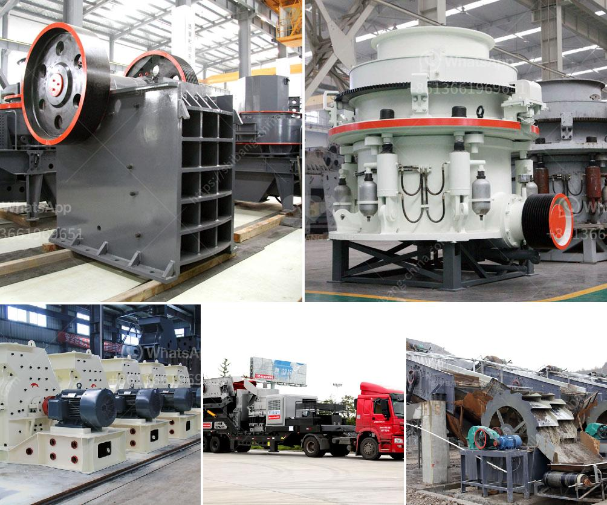

<h3>ball mill for sale zimbabwe</h3>
With the continuous development of mining equipment industry, the ball mill has been widely used in industrial production. For many mining machinery enterprises in Zimbabwe, ball mill for sale in Zimbabwe is the key equipment to break the ores into smaller size or even powder. In Zimbabwe, ball mill for sale also has a huge demand from customers.

Electrically operated and requires minimal maintenance, this powerful machine is capable of grinding the toughest of materials. The ball mill for sale is equipped with a state-of-the-art technology and engineering solution that provides the milling industry with even more extraordinary capabilities. Not only does it guarantee exceptional grinding performance, it also provides several beneficial features including complete control over grinding parameters.

Furthermore, the ball mill for sale in Zimbabwe features low energy consumption. It uses advanced grinding technology to reduce energy consumption substantially. This also ensures efficient grinding of materials with different hardness. Moreover, it guarantees consistent particle size distribution through the entire grinding process.

Considering the available raw materials, the ball mill for sale in Zimbabwe is designed to meet the grinding requirements of the majority of the Zimbabwean mining industry. It offers a range of grinding solutions from the simplest and most cost-effective method to more complex systems for specific applications – achieving the perfect grind every time.

In conclusion, the ball mill for sale in Zimbabwe is ideally suited for the grinding of ores, stone, ceramic materials and paints. It can be used in mineral dressing processes, pyrotechnics, cement, construction materials and chemical industries. With technology advantages, Zimbabwe ball mill for sale is undoubtedly the best choice for mining investors.
<h3>Contact us</h3><ul><li><strong>Whatsapp:&nbsp;<a href="https://wa.me/8613661969651">+8613661969651</a></strong></li><li><a href="https://swt.shibang-china.com/?git&amp;zhl&amp;ball mill for sale zimbabwe"><strong>Online Service(chat now)</strong></a></li></ul><h3>Related</h3><ul><li><a href='used big mobile jaw crusher in dubai.md'>used big mobile jaw crusher in dubai</a></li><li><a href='impact crusher saudi arabia.md'>impact crusher saudi arabia</a></li><li><a href='activated carbon gold mining processing equipment supplier.md'>activated carbon gold mining processing equipment supplier</a></li><li><a href='stone crusher machine dealer in uae.md'>stone crusher machine dealer in uae</a></li><li><a href='use of talc in fertilizer coating process.md'>use of talc in fertilizer coating process</a></li></ul>