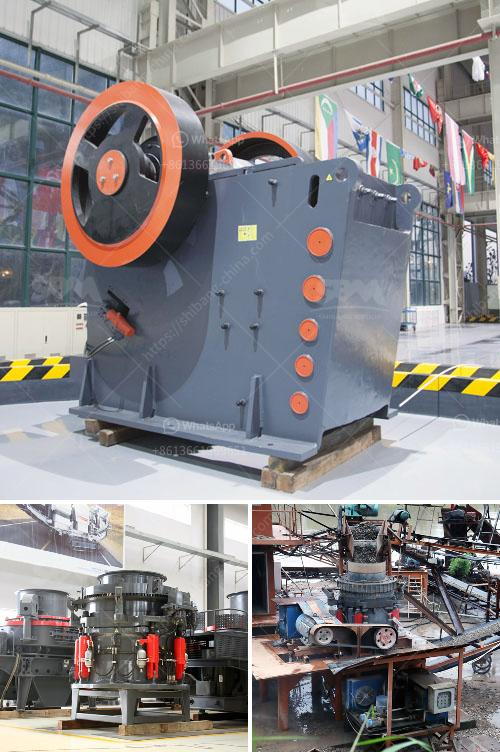

<h3>ball mill for sand and gravel</h3>
A ball mill is a type of cylindrical grinding machine used for grinding materials like ores, chemicals, ceramic raw materials, and paints. Ball mills rotate around a horizontal axis, grinding materials to the desired fineness and quality. They are commonly used in the construction industry to grind sand and gravel to enhance the quality of their products.

Sand and gravel are essential materials in construction projects. They are mainly used as concrete aggregates, base materials for roads and buildings, and as fillers in various construction works. Before these materials can be used, they need to be processed to the desired size and shape. This is where ball mills come in.

Ball mills for sand and gravel processing are designed for continuous operation, meaning that they can be used for long periods without any downtime. This ensures that the material grinding process is not interrupted, resulting in consistent and high-quality end products. The ball mill can also be customized to fit the specific requirements of the materials being processed.

In a ball mill, the grinding media consists of steel or ceramic balls that are loaded into the cylinder and rotated to grind the material. As the balls collide with the material, it is crushed and refined, resulting in a fine powder or slurry. The grinding process is further enhanced by the addition of water or other liquids, which lubricate and cool the grinding media, reducing wear and tear.

Using a ball mill for sand and gravel processing offers several benefits. Firstly, it allows for a more precise and efficient grinding process, as the particle size distribution can be controlled. This improves the overall quality of the end product, ensuring that it meets the required specifications.

Additionally, ball mills can handle a wide range of materials, including those with varying hardness and abrasiveness. This makes them suitable for processing both soft and hard materials, such as sandstone, limestone, and granite. They can easily grind large quantities of material, making them ideal for high-volume production.

In conclusion, ball mills are an essential tool in the sand and gravel processing industry. They offer a reliable and efficient way to grind materials to the desired fineness, resulting in high-quality end products used in various construction projects. With their ability to handle a wide range of materials and customizable features, ball mills are a valuable investment for any sand and gravel processing facility.
<h3>Contact us</h3><ul><li><strong>Whatsapp:&nbsp;<a href="https://wa.me/8613661969651">+8613661969651</a></strong></li><li><a href="https://swt.shibang-china.com/?git&amp;zhl&amp;ball mill for sand and gravel"><strong>Online Service(chat now)</strong></a></li></ul><h3>Related</h3><ul><li><a href='stone crusher pfs price.md'>stone crusher pfs price</a></li><li><a href='flow chart for gold extraction from ores.md'>flow chart for gold extraction from ores</a></li><li><a href='limestone mobile crusher supplier in malaysia.md'>limestone mobile crusher supplier in malaysia</a></li><li><a href='used stone crusher sale in ethiopia.md'>used stone crusher sale in ethiopia</a></li><li><a href='vibrating screen for mesh 14 vibrating screen.md'>vibrating screen for mesh 14 vibrating screen</a></li></ul>