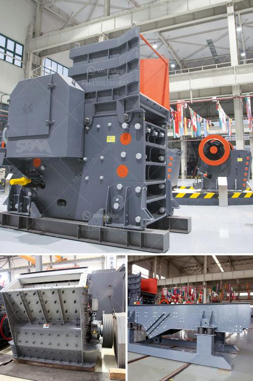

<h3>ball mill grinder for sale</h3>
If you are in the market for a ball mill grinder for sale, you may have wondered how it works and what its uses are. It is a type of grinding machine used to grind materials into extremely fine powder for use in mineral dressing processes, paints, pyrotechnics, ceramics, and selective laser sintering. Ball mills operate on the principle of impact and attrition: the size reduction is done by impact as the balls drop from near the top of the shell. 

Ball mill grinders are commonly used in the manufacture of Portland cement and finer grinding stages of mineral processing. Industrial ball mills can be as large as 8.5 m (28 ft) in diameter with a 22 MW motor, drawing approximately 0.0011% of the total world's power. However, small versions of ball mills can be found in laboratories where they are used for grinding sample material for quality assurance.

The ball mill works on the principle of impact and attrition: the size reduction is done by impact as the balls drop from near the top of the shell. A ball mill consists of a hollow cylindrical shell rotating about its axis. The axis of the shell may be either horizontal or at a small angle to the horizontal. It is partially filled with balls. The grinding media is the balls, which may be made of steel, stainless steel, ceramic, or rubber. The inner surface of the cylindrical shell is usually lined with an abrasion-resistant material such as manganese steel or rubber. 

When the cylindrical shell rotates, the balls are lifted up on the rising side of the shell and then they cascade down from near the top of the shell. The falling balls grind the material, and the ground material is continuously discharged from the cylindrical shell through openings on the circumference.

There are different sizes of ball mill grinders available for industrial and laboratory use. The smaller ones are perfect for grinding sample materials, while the larger ones are suitable for industrial applications. It is essential to choose the right size ball mill grinder for sale based on the intended use.

If you are looking to buy a ball mill grinder for sale, you can find them in various sizes and types. They are available in different materials and can grind a wide range of materials, including hard and abrasive substances. It is important to ensure that the grinder you choose is of high quality, durable, and reliable to ensure the best results. 

In conclusion, a ball mill grinder for sale is a versatile type of grinding machine that is used to grind materials into extremely fine powder. It is ideal for small and large industrial applications, as well as for grinding sample materials in laboratories. When buying a ball mill grinder, it is important to consider the intended use, size, and materials used in its construction to ensure a long-lasting and efficient grinding operation.
<h3>Contact us</h3><ul><li><strong>Whatsapp:&nbsp;<a href="https://wa.me/8613661969651">+8613661969651</a></strong></li><li><a href="https://swt.shibang-china.com/?git&amp;zhl&amp;ball mill grinder for sale"><strong>Online Service(chat now)</strong></a></li></ul><h3>Related</h3><ul><li><a href='project report of lime processing unit.md'>project report of lime processing unit</a></li><li><a href='stone crusher conveyors belt price.md'>stone crusher conveyors belt price</a></li><li><a href='quartz crushing plant for engineered stone.md'>quartz crushing plant for engineered stone</a></li><li><a href='clinker grinding unit of 1000 tpd.md'>clinker grinding unit of 1000 tpd</a></li><li><a href='raymond mills mumbai.md'>raymond mills mumbai</a></li></ul>