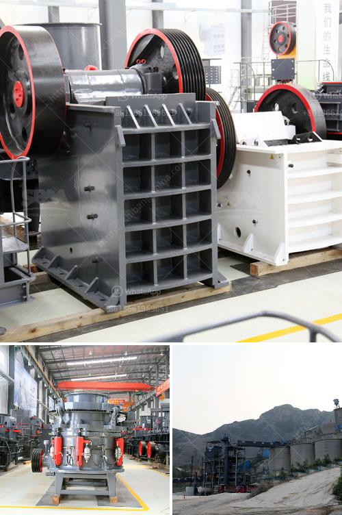

<h3>ball mill grinder</h3>
The ball mill grinder is a grinding machine that is used to grind, and blend materials, using the impact and the grinding techniques applied. It also uses the abrasive materials in order to increase the efficiency by reducing the particle size of the grinding apparatus. This device helps in grinding the materials by using the mechanism of transferring the power to the grinding media (balls, rods, cylpebs, etc.), termed as the "ball charge" in order to promote the grinding process.

The ball mill grinder performs three different types of operations: the closed circuit, open circuit, and circulation grinding tool. The ball mill grinder is of multiple types and has its own specialties according to their grinding media. The ball mill grinder made by the Chinese ball mill manufacturers is applied in industries of cement production, refractory matter production, and ceramics. If you know more about ball mill and its detailed specifications, then please click here to get the latest price of the ball mill machine.

The quality of ball mill grinder produced by Fote Machinery is guaranteed with international advanced level, which is suitable for the fine grinding of various ores and other materials. With its reliable technology, Fote machinery has been with the market trend and has advanced ball mill models in line with the various needs of customers. In addition, we have experienced engineers to provide you with detailed technical guidance. 

Moreover, Fote machinery offers excellent after-sales service. Once the user purchases the ball mill equipment, we promise that the equipment will be installed, tested and put into operation within the promised deadline. Our professional engineers will also provide the necessary maintenance knowledge and help solve any problems during the operation. We are committed to providing the best quality machinery and services to help customers improve their production efficiency.

In summary, the ball mill grinder is an efficient tool that enhances the productivity of manufacturing processes by improving the quality and performance of the final products. The demand for ball mills in various sectors such as cement, mineral, and ceramics is increasing rapidly and thereby contributing to the growth of the ball mill industry.
<h3>Contact us</h3><ul><li><strong>Whatsapp:&nbsp;<a href="https://wa.me/8613661969651">+8613661969651</a></strong></li><li><a href="https://swt.shibang-china.com/?git&amp;zhl&amp;ball mill grinder"><strong>Online Service(chat now)</strong></a></li></ul><h3>Related</h3><ul><li><a href='quartz mining equipments.md'>quartz mining equipments</a></li><li><a href='mica mill roller mill.md'>mica mill roller mill</a></li><li><a href='quarry rock stone crusher germany machine manufacturer.md'>quarry rock stone crusher germany machine manufacturer</a></li><li><a href='mobile concrete crusher uk prices.md'>mobile concrete crusher uk prices</a></li><li><a href='m sand project cost details.md'>m sand project cost details</a></li></ul>