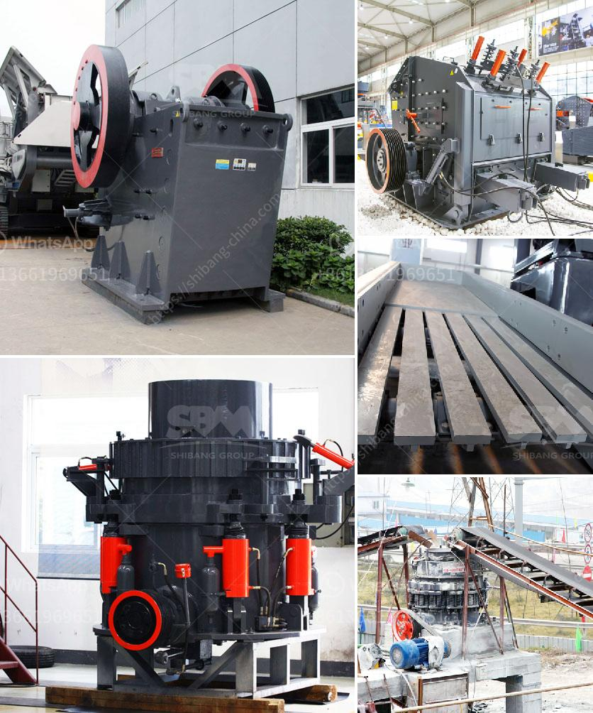

<h3>ball mill grinding china</h3>
Ball mill grinding is a crucial process in various industries like mining, cement, and ceramics. For successful utilization, it is necessary to continuously improve its efficiency and effectiveness. This can be achieved by understanding the performance characteristics of the equipment, as well as utilizing the latest technological advancements. China, being a major player in the manufacturing industry, has made significant contributions to the field of ball mill grinding.

China has a long history of ball mill production. It started from the Ming Dynasty, in the 14th century, when the technique of grinding using porcelain balls was invented. The process was further refined during the Qing Dynasty when porcelain balls were replaced by iron balls. Nowadays, steel balls or ceramic balls are commonly used for grinding materials in ball mills.

One of the factors that contribute to China's success in ball mill grinding is its vast amount of mineral resources. China is known for having large deposits of materials like coal, iron ore, and limestone, which are essential for the production of cement and other industries. This availability of raw materials ensures a steady supply for ball mill grinding.

Another factor that has contributed to China's success is its focus on innovation and technology development. Chinese manufacturers have been investing heavily in research and development to improve the efficiency and effectiveness of ball mill grinding. They have developed advanced grinding systems, such as the ball mill combined with roller press technology, which significantly improves grinding efficiency.

China has also been actively promoting energy-saving and emission-reduction measures in the manufacturing industry. Ball mills consume a considerable amount of energy during the grinding process, making energy-saving solutions highly desirable. In response to this, Chinese manufacturers have developed energy-saving ball mill grinding systems that achieve significant energy savings.

Furthermore, China's manufacturing industry has modernized and adapted to international standards. Many ball mill grinding manufacturers in China now hold ISO9001:2008 quality management system certification, ensuring their products are of the highest quality. In addition, the country has introduced various advanced manufacturing equipment and testing instruments to improve product precision and performance.

China's expertise in ball mill grinding can be seen in its willingness to aid other countries. In 2020, China installed its first large-scale ball mill grinding system in Tanzania to help promote industrialization and increase job opportunities in the region. This gesture further demonstrates China's commitment to sharing its knowledge and resources with the global community.

In conclusion, China's contribution to ball mill grinding cannot be overlooked. Its long history in this field, abundant mineral resources, focus on innovation, energy-saving measures, and adherence to international standards have positioned it as a leading player in the industry. As China continues to invest in research and development, we can expect further advancements and improvements in ball mill grinding technology.
<h3>Contact us</h3><ul><li><strong>Whatsapp:&nbsp;<a href="https://wa.me/8613661969651">+8613661969651</a></strong></li><li><a href="https://swt.shibang-china.com/?git&amp;zhl&amp;ball mill grinding china"><strong>Online Service(chat now)</strong></a></li></ul><h3>Related</h3><ul><li><a href='rock crushing machine for concrete use.md'>rock crushing machine for concrete use</a></li><li><a href='price of mobile crushing plant.md'>price of mobile crushing plant</a></li><li><a href='mobile coal jaw crusher for hire.md'>mobile coal jaw crusher for hire</a></li><li><a href='grinding mill material.md'>grinding mill material</a></li><li><a href='stone crusher conveyors belt price.md'>stone crusher conveyors belt price</a></li></ul>