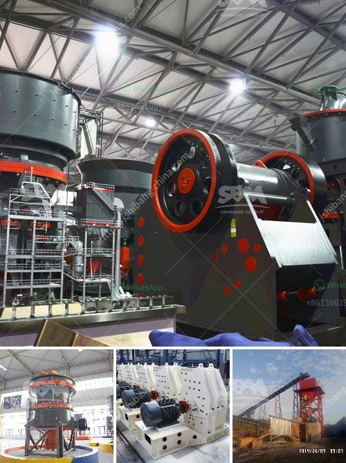

<h3>ball mill hammer mill</h3>
The demand for grinding mills is increasing steadily in today's market. The rise in demand is primarily influenced by advancements in technology, which has led to the development of more efficient grinding equipment. Two such grinding machines commonly used in today's industry are the ball mill and hammer mill.

Both of these grinding machines have their specific uses and advantages, but how do they compare when it comes to their modes of operation, applications, and performance? Let's delve deeper into the world of ball mills and hammer mills to understand their main differences.

Firstly, let's consider the mode of operation. The ball mill operates by rotating a cylinder containing steel balls, causing them to collide with the material being ground. This collision impact leads to the pulverization of the material into fine particles. On the other hand, a hammer mill consists of a rotor with swinging hammers that impact the material, resulting in its fragmentation.

When it comes to applications, ball mills are primarily used in the pharmaceutical, ceramic, and chemical industries for grinding materials into fine powder. Its ability to pulverize small particles makes it ideal for drug manufacturing processes. Hammer mills, on the other hand, find their applications in grain milling, biofuel production, and mining operations. They are best suited for grinding large, bulky materials into smaller particles.

Performance-wise, ball mills are known for their high grinding efficiency and versatility. They can handle both dry and wet materials, making them capable of grinding materials that other grinding machines may struggle with. Additionally, ball mills can achieve a homogeneous grind, which is crucial for some applications. On the other hand, hammer mills are better known for their ability to produce a wide range of particle sizes. They can handle materials with a high moisture content and are considered more forgiving when it comes to variations in feedstock.

Another crucial aspect to consider is maintenance. Both ball mills and hammer mills require regular maintenance to ensure their optimal performance. However, the maintenance needs of each machine differ. Ball mills often require more complicated maintenance tasks, such as changing liners and optimizing operational conditions. Hammer mills, on the other hand, have fewer wearing parts, making them simpler to maintain and more cost-effective in the long run.

In conclusion, ball mills and hammer mills serve distinct purposes in the grinding industry. While ball mills excel in achieving a fine grind, hammer mills are ideal for producing a wide range of particle sizes. Both machines require regular maintenance, but hammer mills might be more cost-effective due to their simplified maintenance needs. Ultimately, the correct choice between these two grinding machines will depend on the specific requirements of each application. Understanding their differences will help in making an informed decision for optimal grinding operations.
<h3>Contact us</h3><ul><li><strong>Whatsapp:&nbsp;<a href="https://wa.me/8613661969651">+8613661969651</a></strong></li><li><a href="https://swt.shibang-china.com/?git&amp;zhl&amp;ball mill hammer mill"><strong>Online Service(chat now)</strong></a></li></ul><h3>Related</h3><ul><li><a href='puzzolana crusher tonnes per hour.md'>puzzolana crusher tonnes per hour</a></li><li><a href='coal washing plant in philippines south africa.md'>coal washing plant in philippines south africa</a></li><li><a href='ballast crushing plant.md'>ballast crushing plant</a></li><li><a href='zimbabwe crusher rental.md'>zimbabwe crusher rental</a></li><li><a href='complete crushing plant solutions prices.md'>complete crushing plant solutions prices</a></li></ul>