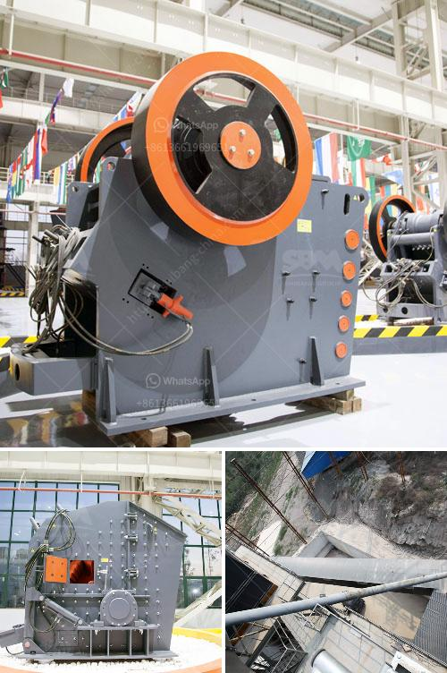

<h3>ball mill india suppliers</h3>
Ball mill is an essential machinery required in the cement industry, paint industry, textile industry, metallurgy industry, pharma industry, and many more. With such a wide range of applications, ball mills are indispensable for their efficiency, reliability, and durability.

India's leading ball mill suppliers, manufacturers, and exporters offer wide range of ball mills that are fabricated from high-quality materials, ensuring huge capacity, high efficiency, fine accuracy, and strong adaptability. These mills are used for grinding various kinds of materials like limestone, clinker, coal, iron ore, gypsum, fly ash, and many more.

The ball mills supplied by the renowned manufacturers in India are available in different capacities and specifications as per the requirements of customers. The wide range of ball mill machines that we offer incorporates a spectrum of exclusive engineering products such as industrial silos, precision engineered plate fabrication, chute work, silo cutting and erection, etc.

These mills are designed for continuous heavy-duty operation with minimum maintenance and less power consumption. The ball mills manufactured in India enable to grind various ores and materials in wet and dry conditions to meet the requirements of different industries.

Additionally, these mills are designed with both bolted and welded shell lining plates for easy maintenance and reliable operations. The high-quality alloy steel used in the ball mill shell and the end liners increase the wear resistance to ensure long-lasting performance.

Furthermore, the ball mill suppliers in India also provide customized solutions in accordance with the specific requirements of industries. The high-quality mills offered by these suppliers have advanced internal ventilation systems, which help to reduce the energy consumption and enhance the overall productivity.

In conclusion, ball mills play a crucial role in the industries mentioned above. India has become one of the leading suppliers of ball mills due to its excellent quality, cost-effectiveness, and availability of reliable products. The country's manufacturers employ advanced technology and high-quality materials to fabricate outstanding ball mills that provide exceptional performance in various industries.
<h3>Contact us</h3><ul><li><strong>Whatsapp:&nbsp;<a href="https://wa.me/8613661969651">+8613661969651</a></strong></li><li><a href="https://swt.shibang-china.com/?git&amp;zhl&amp;ball mill india suppliers"><strong>Online Service(chat now)</strong></a></li></ul><h3>Related</h3><ul><li><a href='puzzolana crusher tonnes per hour.md'>puzzolana crusher tonnes per hour</a></li><li><a href='wet process cement.md'>wet process cement</a></li><li><a href='stone dust making machine.md'>stone dust making machine</a></li><li><a href='stone crusher cement factories in africa.md'>stone crusher cement factories in africa</a></li><li><a href='quotation for stone crusher.md'>quotation for stone crusher</a></li></ul>