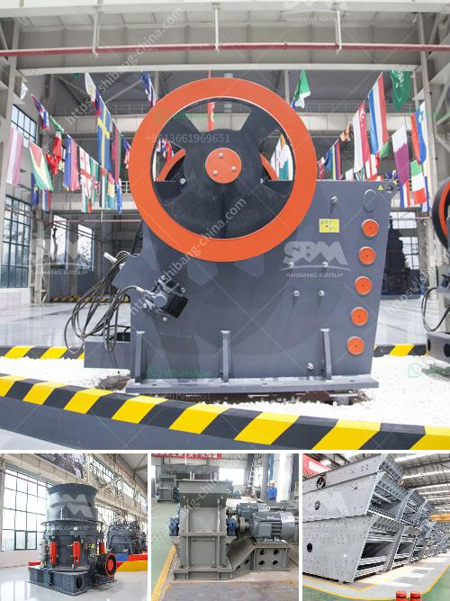

<h3>ball mill laboratory philippines</h3>
The laboratory ball mill is a type of grinding equipment used to refine particles, but in times of continuous technological advancement, scientists have found a way to incorporate ball mills into laboratories for sample preparation. Common applications for the laboratory ball mill include creating powders, fine milling, and homogenizing geological materials like rocks and minerals. 

In the Philippines, the laboratory ball mill is primarily utilized for sample preparation. Not only does it play a vital role in the feasibility of transforming ores into valuable commodities, but it is also a cost-effective solution for conducting metallurgical studies, scoring valuable minerals, and analyzing mineral liberation.

One popular use of the laboratory ball mill is for grinding coal for combustion analysis in thermal power plants. This powerful machine allows researchers to precisely measure the changes in coal mass during combustion, thereby providing valuable information to improve plant efficiency and reduce environmental impact.

Moreover, the laboratory ball mill is also used in metallurgy, construction, chemistry, and other industries for sample preparation and particle size analysis. With its wide range of applications, the laboratory ball mill is indispensable for many research and development projects.

In the Philippines, the laboratory ball mill is widely utilized to process mineral ores into fine powders. As a leading mining and metallurgical equipment manufacturer in the region, Fote Heavy Machinery has created a unique market position by producing high-quality equipment especially designed for sample preparation and data analysis. 

Fote’s laboratory ball mills are robust and reliable tools that deliver consistent results. With a wide range of available sizes and capacities, these ball mills are suitable for both small and large-scale laboratories. The user-friendly control panel allows researchers to easily adjust and monitor various parameters such as rotation speed, temperature, and time, ensuring accuracy and reproducibility of experimental conditions.

In addition to providing high-quality laboratory ball mills, Fote also offers a comprehensive range of supporting equipment and accessories to optimize performance. These include grinding media, jars, and vials made from diverse materials such as stainless steel, alumina, zirconia, and tungsten carbide. Furthermore, Fote also provides customized solutions to meet specific research requirements.

The laboratory ball mill has played an essential role in various scientific research and development activities in the Philippines. Its versatility and reliability make it an indispensable tool for scientists and researchers who seek to improve processes in various fields. By providing high-quality laboratory ball mills and outstanding customer support, Fote Heavy Machinery has established itself as a leading player in this market, catering to the needs of laboratories and industries alike.
<h3>Contact us</h3><ul><li><strong>Whatsapp:&nbsp;<a href="https://wa.me/8613661969651">+8613661969651</a></strong></li><li><a href="https://swt.shibang-china.com/?git&amp;zhl&amp;ball mill laboratory philippines"><strong>Online Service(chat now)</strong></a></li></ul><h3>Related</h3><ul><li><a href='defination of machine aggregate crusher.md'>defination of machine aggregate crusher</a></li><li><a href='precipitated calcium carbonate process.md'>precipitated calcium carbonate process</a></li><li><a href='three roll mills supplier.md'>three roll mills supplier</a></li><li><a href='the company mines limestone in ethiopia.md'>the company mines limestone in ethiopia</a></li><li><a href='price stone crusher dragon.md'>price stone crusher dragon</a></li></ul>