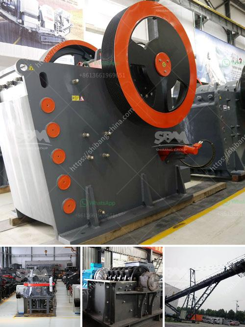

<h3>ball mill machine in china</h3>
The ball mill machine is a key equipment to grind the crushed materials. By rotating the ball mill, the materials are ground into a fine powder and it is widely used in mineral processing, building materials and chemical industry. China has more than three thousand ball mill manufacturers, and the products are sold to more than 60 countries in the world.

Ball mill machine is the key equipment for grinding after the crushing process, the working process is defined by the closed system process with the uniform feeding size, constant output materials and low energy consumption. The material is fed into the hollow cylinder through the feeding system, and the steel balls inside the cylinder are thrown off when the cylinder rotates, which causes the materials to be ground into a fine powder.

China has a long history in manufacturing ball mill machines. The ball mill machine in China is widely used in cement, coal, power plant desulfurization, limestone, ore processing and other industries. The final products can be used in power plant, steel plant and other industries. The ball mill is easy to operate and maintenance, and the capacity is very large, making it a popular choice for large-scale projects.

The ball mill machine in China is highly regarded for its energy efficiency and environmental protection features, with a large reduction ratio, low power consumption and stable performance. It has been widely used in various industrial sectors such as cement, coal, power plant desulfurization, metallurgy, chemical industry and non-metallic mineral processing.

In recent years, the ball mill machine in China has been improved in design and performance. With the continuous development of technology, China's ball mill machine has made great progress in automation, digitalization and intelligentization. The new generation of ball mill machines in China are equipped with advanced control systems, which greatly improve the operation efficiency and stability of the ball mill machines.

China's ball mill machine manufacturers have made remarkable achievements in the international market. They have exported their ball mill machines to more than 60 countries, including South Africa, Indonesia, Mexico, Thailand, Malaysia, Philippines, Vietnam, Peru, Pakistan and so on. The ball mill machines made in China are highly recognized and praised by customers from all over the world.

In conclusion, the ball mill machine in China is a highly efficient and high-quality machine that is widely used in various industrial sectors. With the continuous development of technology, China's ball mill machine manufacturers have made remarkable progress in design, performance and automation. The ball mill machines made in China have been exported to more than 60 countries and have gained a good reputation in the international market. China's ball mill machine manufacturers will continue to improve the quality and performance of their products to meet the growing demand of customers from all over the world.
<h3>Contact us</h3><ul><li><strong>Whatsapp:&nbsp;<a href="https://wa.me/8613661969651">+8613661969651</a></strong></li><li><a href="https://swt.shibang-china.com/?git&amp;zhl&amp;ball mill machine in china"><strong>Online Service(chat now)</strong></a></li></ul><h3>Related</h3><ul><li><a href='sand making machine from china.md'>sand making machine from china</a></li><li><a href='mobile stone crusher price philippines.md'>mobile stone crusher price philippines</a></li><li><a href='vibrating screen in egypt.md'>vibrating screen in egypt</a></li><li><a href='market analysis of stone crusher.md'>market analysis of stone crusher</a></li><li><a href='small crushing machines for gold.md'>small crushing machines for gold</a></li></ul>