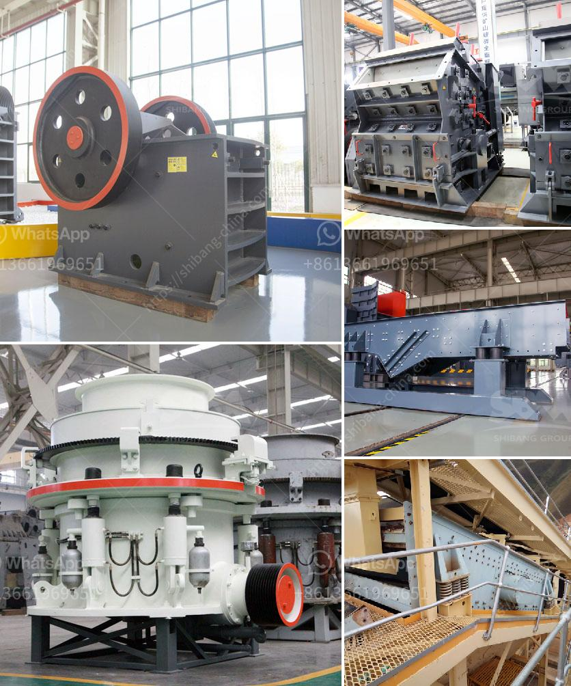

<h3>ball mill manufacturers in india</h3>
Ball mill is an essential part of many industrial processes. It mainly used to grind materials like ceramic, glass, clinker, slag and other similar materials. It is an efficient tool for grinding various materials into fine powder. There are two ways of grinding: the dry process and the wet process. It can be divided into tubular type and flowing type depending on different forms of discharging material.

In recent years, the demand for ball mills in India has been increasing. With the rapid development of various industries, mining, construction, metallurgy, chemicals and other fields, it is necessary to constantly update the ball mill to meet the needs of the market. Therefore, the ball mill manufacturers are constantly striving to improve the quality and efficiency of their products.

India is rich in mineral resources and has a strong demand for various mining equipment. From coal, iron ore, cement to gold, diamonds, India is home to countless mines, each of which requires a durable and energy-efficient ball mill to grind the extracted material. The ball mill is widely used in cement, silicate products, new building materials, refractory materials, fertilizer, black and non-ferrous metal processing and glass ceramics production industry. It can be used to grind various ores and other materials, and is widely used in mineral processing, building materials and chemical industry.

There are many ball mill manufacturers in India. The quality of the equipment produced by these manufacturers varies greatly, and the price is also uneven. So what factors should be considered when choosing a ball mill manufacturer?

First, the reputation of the manufacturer is very important. Before buying equipment, it is necessary to investigate the manufacturer's production strength, technical level, customer feedback, etc., and choose a manufacturer with good reputation and high customer satisfaction.

Second, the production capacity of the manufacturer is also a key factor to consider. Different manufacturers have different production capacity and scale. It is necessary to choose a manufacturer with large production capacity to ensure that there is no problem in delivering the equipment on time.

Third, the after-sales service of the manufacturer. After-sales service is very important. A good manufacturer can provide professional technical support and timely maintenance and repair services, which can greatly reduce the downtime and ensure the production efficiency.

Fourth, the price of the equipment. The price of the equipment is an important factor that needs to be considered. It is best to compare the prices of different manufacturers and choose a manufacturer with reasonable prices, not only based on the price, but also considering the quality and after-sales service.

In conclusion, when choosing ball mill manufacturers in India, it is very important to consider these factors: reputation, production capacity, after-sales service and price. With the continuous development of mineral resources in India, the demand for ball mills will continue to increase, and ultimately it will bring great opportunities for the development of ball mill manufacturers in India.
<h3>Contact us</h3><ul><li><strong>Whatsapp:&nbsp;<a href="https://wa.me/8613661969651">+8613661969651</a></strong></li><li><a href="https://swt.shibang-china.com/?git&amp;zhl&amp;ball mill manufacturers in india"><strong>Online Service(chat now)</strong></a></li></ul><h3>Related</h3><ul><li><a href='stone crusher plant south africa.md'>stone crusher plant south africa</a></li><li><a href='cutting milling machine for marble and granite.md'>cutting milling machine for marble and granite</a></li><li><a href='aggregate production equipment.md'>aggregate production equipment</a></li><li><a href='roller coal mill.md'>roller coal mill</a></li><li><a href='dust reduction system for stone crusher plant.md'>dust reduction system for stone crusher plant</a></li></ul>