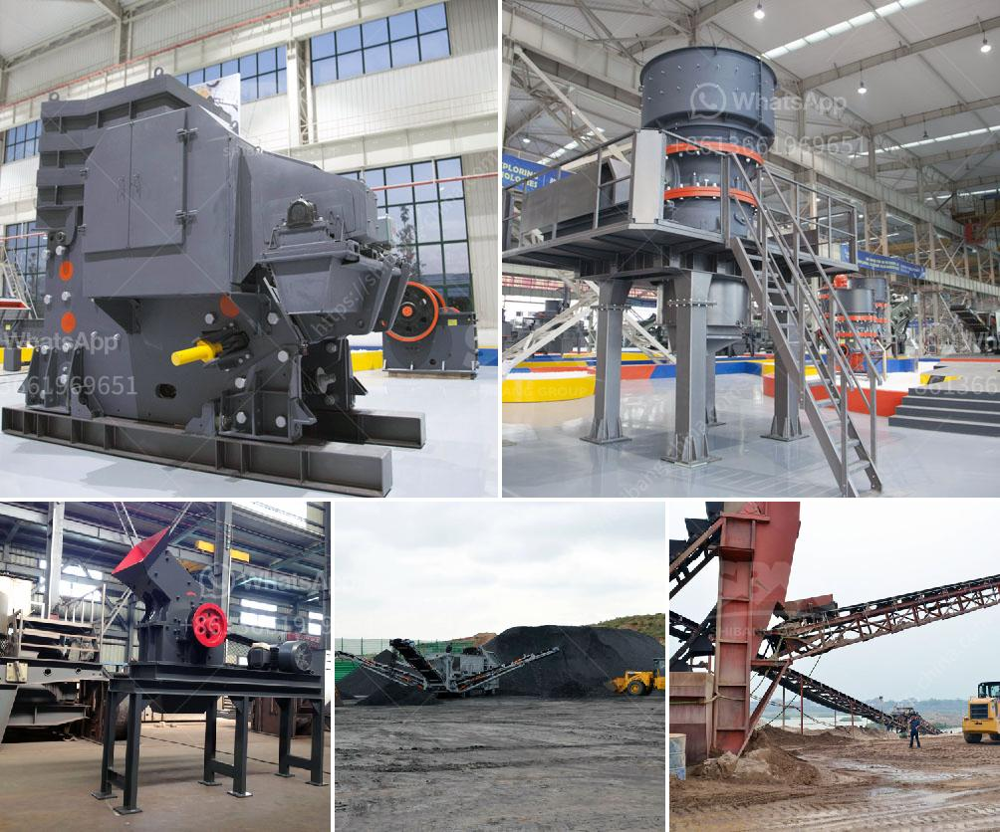

<h3>ball mill manufacturers in mumbai</h3>
India, the leading country in the manufacturing sector, continuously strives to strengthen its position in the global market. Mumbai, the financial capital and the largest city in India, is well-known for its vibrant business environment. The city houses numerous industries that cater to diverse sectors, with manufacturing being one of the key verticals. As a major player in the manufacturing industry, Mumbai is home to several ball mill manufacturers who have carved out a niche for themselves in the market.

A ball mill is a type of cylindrical grinding machine utilized for grinding materials into fine powder. It is used in various industrial applications, including cement, silicate, new building materials, refractory materials, fertilizers, paint, ceramics, etc. In Mumbai, there are numerous manufacturers supplying highly efficient ball mills to various industries. These manufacturers are known for their technologically advanced machinery and provide customized solutions to meet the specific requirements of their clients.

One of the prominent ball mill manufacturers in Mumbai, PROMAS ENGINEERS, has been providing reliable solutions to various industries with their high-quality equipment. They have established a solid reputation for delivering top-notch ball mills that exhibit superior performance, durability, and efficiency. Their team of skilled engineers designs and manufactures ball mills using cutting-edge technology and state-of-the-art machinery. They also emphasize meeting global quality standards to ensure their products are at par with international competitors.

Another reputed name in the industry, BALL MILL INDIA, offers technologically advanced ball mills that are engineered to perfection. They strive to provide efficient grinding solutions to their clients by employing innovative techniques and high-grade materials in their manufacturing process. With a team of experienced professionals, BALL MILL INDIA focuses on delivering superior quality products that are not only reliable but also cost-effective.

Furthermore, the metropolis of Mumbai is home to several other esteemed ball mill manufacturers who have succeeded in establishing a strong position in the market. These manufacturers endeavour to provide their clients with a wide range of ball mills that cater to various industrial requirements. They understand the importance of delivering reliable, highly efficient, and durable equipment to enhance their clients' manufacturing processes. Moreover, these manufacturers also offer excellent after-sales service to ensure smooth operations for their customers.

The presence of numerous ball mill manufacturers in Mumbai highlights the city's significance as an industrial hub in India. The city's business-friendly environment, infrastructure, and skilled workforce make it an ideal location for manufacturing endeavors. Additionally, Mumbai's strategic location and excellent connectivity via air, rail, and sea routes further contribute to its position as a preferred business destination.

In conclusion, Mumbai is a prominent industrial hub in India, housing several ball mill manufacturers who provide top-quality equipment to various industries. These manufacturers strive to deliver cost-effective, reliable, and efficient ball mills that cater to diverse industrial requirements. Their technologically advanced machinery and commitment to quality showcase their prowess in the manufacturing sector. With Mumbai's conducive business ecosystem and favorable government policies, the city continues to attract manufacturers from across the country, further solidifying its status as a manufacturing powerhouse in India.
<h3>Contact us</h3><ul><li><strong>Whatsapp:&nbsp;<a href="https://wa.me/8613661969651">+8613661969651</a></strong></li><li><a href="https://swt.shibang-china.com/?git&amp;zhl&amp;ball mill manufacturers in mumbai"><strong>Online Service(chat now)</strong></a></li></ul><h3>Related</h3><ul><li><a href='mobile crushers in malaysia.md'>mobile crushers in malaysia</a></li><li><a href='crushing machine price.md'>crushing machine price</a></li><li><a href='hydration process of cement.md'>hydration process of cement</a></li><li><a href='rock crushing plants for sale.md'>rock crushing plants for sale</a></li><li><a href='application of ball mill in industries.md'>application of ball mill in industries</a></li></ul>