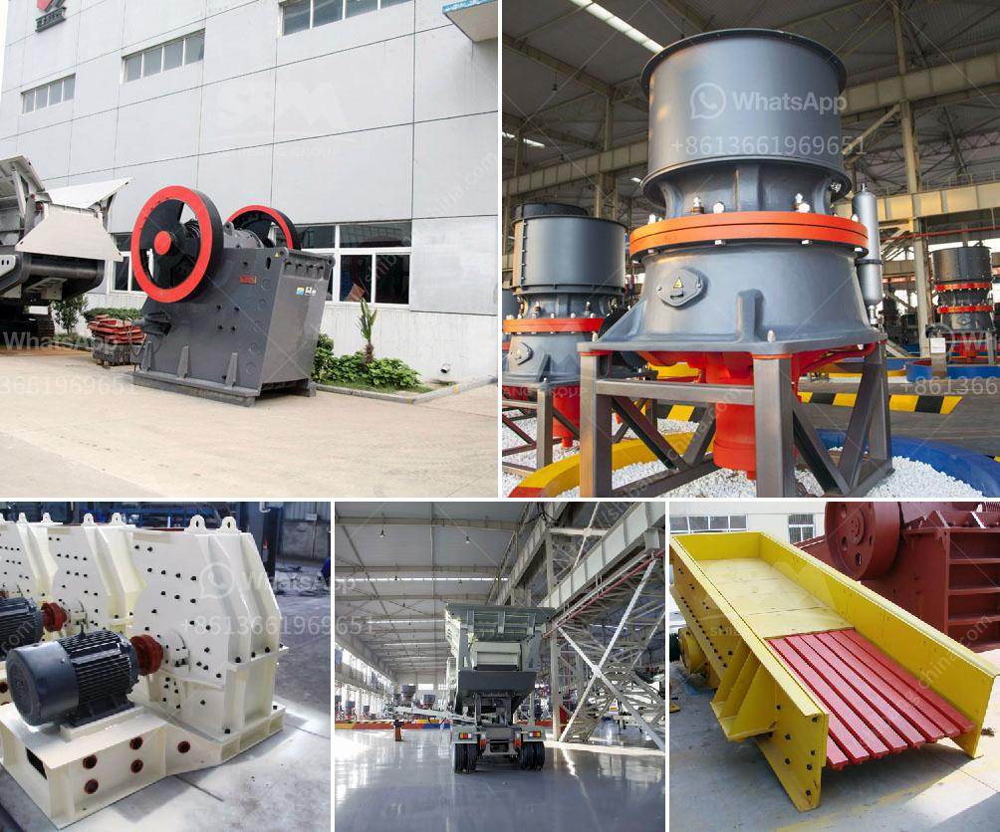

<h3>ball mill micron</h3>
Ball mill micron, also known as ball mill finisher, is the equipment used to grind materials into fine particles. With continuous development of technology, the modern ball mill micron is able to achieve fine and even ultrafine particle sizes, making it an essential tool in various industries.

One of the biggest advantages of the ball mill micron is its ability to reduce the particle size distribution, leading to higher efficiency in applications such as chemical processing, ceramic raw materials, and paints. By grinding materials down to micron-sized particles, it ensures that the desired particle size is achieved, improving product quality and performance.

The ball mill micron works by rotating a cylinder with grinding balls, which causes the balls to fall back into the cylinder and onto the material to be ground. The rotation is usually between 4 to 20 revolutions per minute, depending on the diameter of the mill. As the material is ground, it is exposed to the grinding media, resulting in the reduction of particle size.

In addition to the reduction in particle size, the ball mill micron also offers other benefits. It can be used for both dry and wet grinding, making it suitable for a wide range of applications. It is also relatively easy to operate and maintain, making it a popular choice among manufacturers and researchers.

The ball mill micron is often used in research laboratories for the development of new materials and the improvement of existing ones. It is also widely used in the pharmaceutical industry for the production of medicines, as well as in the food industry for the grinding of ingredients.

In conclusion, the ball mill micron is an essential tool for the grinding and reduction of particle size. Its ability to achieve fine and even ultrafine particle sizes makes it indispensable in various industries. With continuous advancements in technology, the ball mill micron is expected to become even more efficient and versatile in the future.
<h3>Contact us</h3><ul><li><strong>Whatsapp:&nbsp;<a href="https://wa.me/8613661969651">+8613661969651</a></strong></li><li><a href="https://swt.shibang-china.com/?git&amp;zhl&amp;ball mill micron"><strong>Online Service(chat now)</strong></a></li></ul><h3>Related</h3><ul><li><a href='belt conveyor for sale china.md'>belt conveyor for sale china</a></li><li><a href='activated carbon plant business plan.md'>activated carbon plant business plan</a></li><li><a href='crushed stones aggregate in uganda.md'>crushed stones aggregate in uganda</a></li><li><a href='sample quotation letter for sand and stone.md'>sample quotation letter for sand and stone</a></li><li><a href='vertical grinding machine for foundry.md'>vertical grinding machine for foundry</a></li></ul>