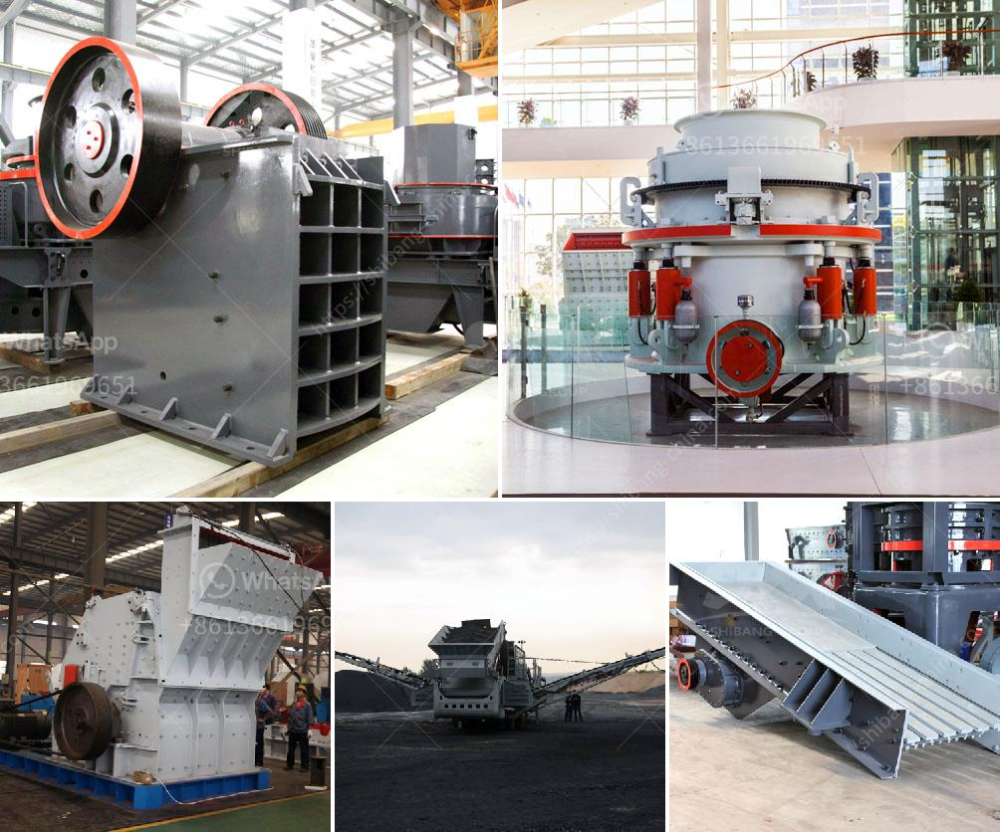

<h3>ball mill pakistan for sale</h3>
Ball mills are used to grind and mix materials, used in the ceramic industry, paint industry, mechanical alloying, pharmaceuticals, and more. In recent years, ball mills have been widely used in Pakistan due to their simple operation, saving energy consumption, and low investment costs.

1. Size Reduction Efficiency: The grinding process in a ball mill is quite straightforward and ensures the efficient reduction of particles down to the required size. The mill can handle both dry and wet grinding, making it suitable for a wide variety of materials.

2. Cost-effective: Ball mills require minimal initial investment and can be operated with low maintenance costs. Compared to other grinding equipment, they provide excellent value for money in terms of long-term performance and productivity.

3. Versatility: Ball mills are suitable for grinding different types of materials, such as minerals, ores, chemicals, ceramics, and more. Their versatility makes them an ideal choice for various industries.

4. High Energy Efficiency: Ball mills are designed to utilize energy-efficient grinding methods, which result in lower energy consumption and reduced operational costs. This makes them environmentally friendly, as they help to conserve energy resources.

5. Easy Operation: Ball mills are designed with user-friendly controls and mechanisms, making them easy to operate for individuals of all skill levels. Moreover, modern ball mills are equipped with advanced automation features, further simplifying the operation process.

Currently, Pakistan has a high need for basic infrastructure, housing, and services, and therefore a robust growth in the demand for cement, ZENITH feel it a great honor to participate in the development of cement industry in Pakistan. Cement ball mill refers to the ball grinding mill used for grinding cement clinker and raw materials of cement. Nowadays, market demand for cement ball mill is increasing. Cement ball mill for sale in Pakistan has been widely recognized by the local market, helping our customers to improve the efficiency of cement production and reduce energy consumption.

1. Advanced Technology: Our ball mill techniques have been enhanced over the years, ensuring excellent power consistency and run-time.

2. Customization Options: We offer customized ball mill solutions and can tailor the equipment to meet specific production requirements.

3. Competitive Pricing: Our ball mills are competitively priced without sacrificing quality or performance.

4. Efficient After-sales Service: We have a dedicated team of professionals ready to assist clients with any concerns or queries after purchase, ensuring a seamless user experience.

Ball mills have been widely used in Pakistan due to their effectiveness. They are versatile grinding machines that can handle a wide range of materials, making them ideal for various industries. The availability of ball mills at competitive prices in Pakistan makes them an attractive option for businesses looking to optimize their operations and increase their productivity. So, if you're in need of a reliable grinding solution, consider investing in a ball mill for long-term efficiency gains.
<h3>Contact us</h3><ul><li><strong>Whatsapp:&nbsp;<a href="https://wa.me/8613661969651">+8613661969651</a></strong></li><li><a href="https://swt.shibang-china.com/?git&amp;zhl&amp;ball mill pakistan for sale"><strong>Online Service(chat now)</strong></a></li></ul><h3>Related</h3><ul><li><a href='jaw crusher equipment supplier.md'>jaw crusher equipment supplier</a></li><li><a href='grinding ball mill machine.md'>grinding ball mill machine</a></li><li><a href='puzzolana 100tph cone crusher plant price.md'>puzzolana 100tph cone crusher plant price</a></li><li><a href='how to make clay powder machine.md'>how to make clay powder machine</a></li><li><a href='suppliers of chromite sand from south africa.md'>suppliers of chromite sand from south africa</a></li></ul>