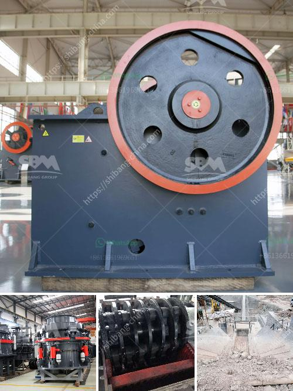

<h3>ball mill pulverizer</h3>
A ball mill pulverizer is a mechanical device used to grind materials into a fine powder for combustion purposes in the steam-generating furnaces of fossil fuel power plants. This machine takes advantages of a wide range of materials, such as limestone, calcite, dolomite, petroleum coke, gypsum, barite, marble, talc, coal powder, etc.

The ball mill pulverizer consists of a rotating drum, a stationary grinding media, and a gate that seals the pulverized coal inside the drum. The drum rotates at a predetermined speed to efficiently crush and pulverize the coal. It is usually lined with abrasion-resistant material such as manganese steel or rubber to prevent wear and tear.

The coal is fed into the drum through a central inlet pipe and is ground between the grinding media and the stationary gate. As the drum rotates, the coal is crushed and ground into a fine powder. The pulverized coal is then blown into the combustion chamber of the boiler, where it ignites and releases energy in the form of heat.

The efficiency of a ball mill pulverizer is determined by the performance of its grinding media. Typically, high-quality grinding balls are used to crush and grind the coal. The size and hardness of the grinding media have a significant impact on the pulverizing process. Larger and harder grinding balls can crush the coal more effectively, resulting in higher pulverizing efficiency.

In addition to coal pulverizing, ball mills can also be used for other grinding applications such as cement, limestone, clinker, slag, and metal ores. The pulverizing process in a ball mill is highly energy intensive. It requires a large amount of electricity to operate the equipment and grind the materials. Therefore, the selection of a suitable grinding system is crucial to ensure cost-effective and energy-efficient operation.

Several factors need to be considered when choosing a ball mill pulverizer. The desired fineness of the pulverized material, the grindability of the material, and the required pulverizing capacity are some of the key factors to consider. Additionally, the maintenance requirements, wear and tear of the equipment, and the availability of spare parts should also be taken into account.

Overall, a ball mill pulverizer is an essential tool in the process of pulverizing coal and other materials in power plants and various industrial applications. It offers efficient and reliable operation and can grind a wide range of materials to the desired fineness. With proper maintenance and care, a ball mill pulverizer can serve its purpose for many years, ensuring reliable operation and energy-efficient pulverizing.
<h3>Contact us</h3><ul><li><strong>Whatsapp:&nbsp;<a href="https://wa.me/8613661969651">+8613661969651</a></strong></li><li><a href="https://swt.shibang-china.com/?git&amp;zhl&amp;ball mill pulverizer"><strong>Online Service(chat now)</strong></a></li></ul><h3>Related</h3><ul><li><a href='copper concentrate ball mill for sale.md'>copper concentrate ball mill for sale</a></li><li><a href='quarry crusher plant in malaysia.md'>quarry crusher plant in malaysia</a></li><li><a href='quartz stone making process.md'>quartz stone making process</a></li><li><a href='crusher stone crusher 4 ton.md'>crusher stone crusher 4 ton</a></li><li><a href='sand quarry plant.md'>sand quarry plant</a></li></ul>