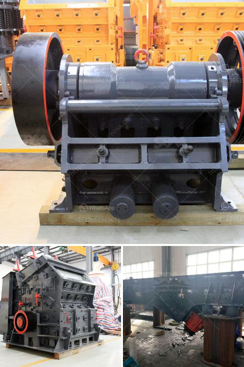

<h3>ball mill screen 200 tph</h3>
The ball mill screen 200 tph is designed in a square shape and utilizes a vibrating screen. The screen surface has a surface of 2300 square inches. The screening capacity is 24 metric tons per hour, providing consistent and reliable screening results. The efficient design of the screen ensures a consistent particle size distribution, minimizing the presence of oversized particles.

The ball mill screen 200 tph is suitable for various materials, including minerals, ores, coal, fertilizers, and chemicals. It is commonly used in cement plants, ore beneficiation plants, and power plants to screen materials before the grinding process. The screening process helps to remove impurities and improve the quality of the final product.

The vibrating screen of the ball mill screen 200 tph is equipped with multiple layers, ensuring efficient separation of particles. The screen is made of high-quality materials and is resistant to wear and tear, ensuring a long service life. The screen can easily be replaced when worn out, reducing downtime and maintenance costs.

The ball mill screen 200 tph is easy to operate and requires minimal maintenance. It is equipped with a reliable motor and a strong vibrating mechanism, ensuring smooth and consistent operation. The screen can be adjusted to different angles, allowing for optimal screening efficiency for different materials.

In conclusion, the ball mill screen 200 tph is a versatile and efficient screening solution for various industries. Its reliable performance, durable construction, and easy operation make it a valuable addition to any processing plant. Whether used for pre-screening or final screening, this vibrating screen provides consistent and high-quality screening results, ensuring a smooth and efficient grinding process.
<h3>Contact us</h3><ul><li><strong>Whatsapp:&nbsp;<a href="https://wa.me/8613661969651">+8613661969651</a></strong></li><li><a href="https://swt.shibang-china.com/?git&amp;zhl&amp;ball mill screen 200 tph"><strong>Online Service(chat now)</strong></a></li></ul><h3>Related</h3><ul><li><a href='mobile crushers in malaysia.md'>mobile crushers in malaysia</a></li><li><a href='portable ballast crusher for sale.md'>portable ballast crusher for sale</a></li><li><a href='how to make limestone powder.md'>how to make limestone powder</a></li><li><a href='controlling parameter of impact crusher.md'>controlling parameter of impact crusher</a></li><li><a href='how many kg in 1 cubic feet of 20mm crusher stone.md'>how many kg in 1 cubic feet of 20mm crusher stone</a></li></ul>