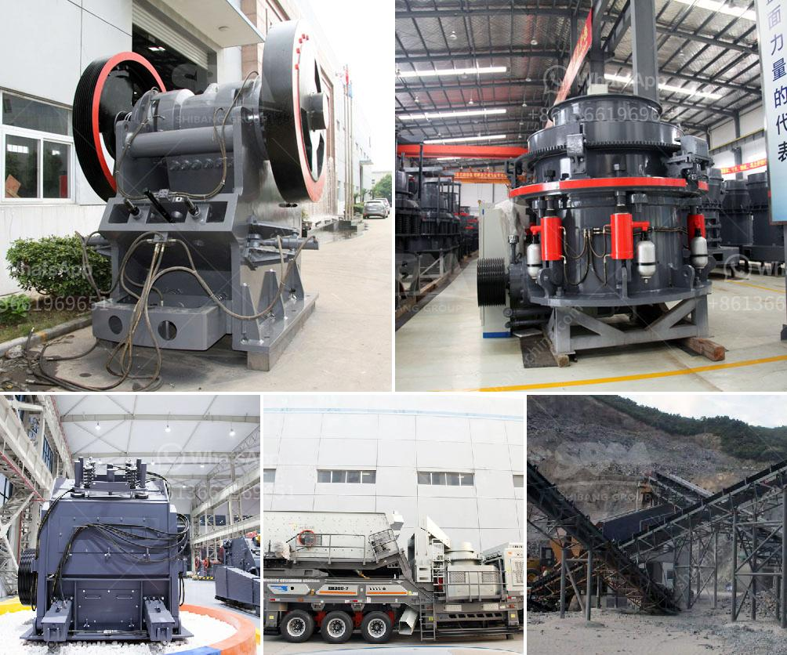

<h3>ball mill specification limestone grinding</h3>
Ball mill is a key equipment to grind the crushed materials, and the ball mill is widely used in powder-making production line including cement, silicate, new-type building material, refractory material, fertilizer, ore dressing of ferrous metal and non-ferrous metal, glass ceramics, etc. And the ball mill can grind various ores and other materials with dry type and wet type.

There are two kinds of ball mill, grate type and overfall type due to different ways of discharging material. The ball mill is a horizontal rotating device transmitted by the outer gear. The materials are transferred to the grinding chamber through the quill shaft uniformly. There are ladder liner and ripple liner and different specifications of steel balls in the chamber. The centrifugal force caused by rotation of barrel brings the steel balls to a certain height to impact and grind the materials.

Ball mill specification limestone grinding is a key equipment for regrinding. It is widely used for the cement, the silicate product, new type building material, fire-proof material, chemical fertilizer, black and non-ferrous metal, glass, ceramics and etc. The mineral ball mill can grind ore or other materials that can be grinded either by wet process or by dry process. Features of Ball Mill Grinding:

1. This type of ball mill is a kind of traditional ball mill, with rolling bearings (Babbit metal bearing bushing seat).

5. Compared with traditional ball mill, the working efficiency can be increased by 15-20%, and the motor power is reduced by 10-20%.

6. It is an ideal grinding equipment for comminution of material in industries like metallurgy, chemical industry, building materials, and construction materials, etc.

The limestone grinding mill is widely used in grinding of limestone, phosphate, marble, feldspar, talc, gypsum, kaolin, bentonite, and other non-metallic materials. Limestone can be used as a filler in the production of pigments, paints, ceramics, pharmaceuticals, coatings, construction materials, etc. The fineness of the finished product can be adjusted from 325-2500 mesh, which makes it suitable for various industrial sectors.

The limestone grinding mill can be divided into coarse grinding and fine grinding according to the processing requirements. Limestone powder, as a raw material of cement production, is extracted by limestone crushers, and then grinded by a limestone mill. The limestone mill can grind different sizes of limestone into powder and get the raw material for cement production. It can grind materials with Mohs hardness below 7 and moisture below 6%, such as barite, limestone, pottery, marble, talc, gypsum, etc.

In conclusion, ball mill specification limestone grinding is an important equipment in the mining and construction industry. It has many favorable characteristics such as simple structure, convenient maintenance, high grinding efficiency, low energy consumption, and large output. With the continuous improvement of technology, ball mill specification limestone grinding will continue to develop and become more advanced, providing excellent grinding equipment for the industry.
<h3>Contact us</h3><ul><li><strong>Whatsapp:&nbsp;<a href="https://wa.me/8613661969651">+8613661969651</a></strong></li><li><a href="https://swt.shibang-china.com/?git&amp;zhl&amp;ball mill specification limestone grinding"><strong>Online Service(chat now)</strong></a></li></ul><h3>Related</h3><ul><li><a href='crusher plant sale.md'>crusher plant sale</a></li><li><a href='clinker crsher plant for sale.md'>clinker crsher plant for sale</a></li><li><a href='stone crusher for tractor.md'>stone crusher for tractor</a></li><li><a href='enquiry about rock crusher.md'>enquiry about rock crusher</a></li><li><a href='company that sells vibratory sieves in spain.md'>company that sells vibratory sieves in spain</a></li></ul>