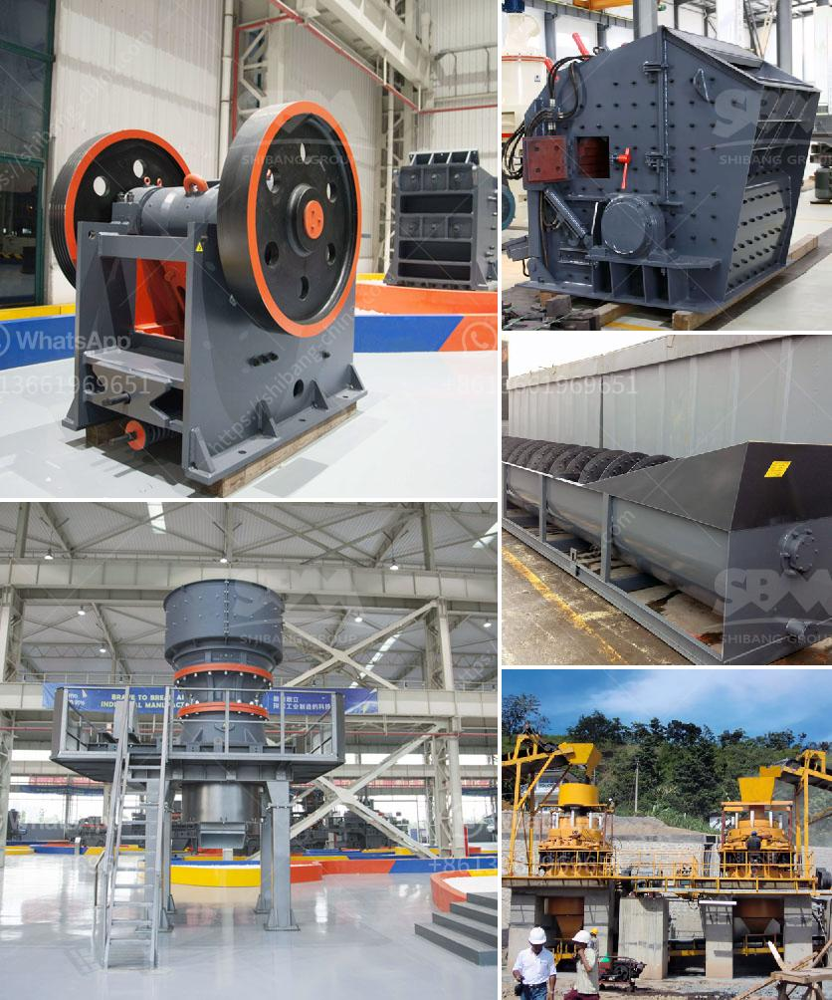

<h3>ball mill unloading system in india</h3>
India is one of the world's largest producers of cement and other minerals. With growth in the construction sector, the demand for cement has also increased. To meet this demand, various cement companies in India are expanding their production capacities by installing new ball mills.

A ball mill is a type of grinder used to grind and blend materials for use in mineral dressing processes, paints, pyrotechnics, ceramics, and selective laser sintering. It works on the principle of impact and attrition: size reduction is done by impact as the balls drop from near the top of the shell.

While ball mills are efficient grinding machines, they also require specialized equipment to handle the unloading process. The unloading system for ball mills is critical to optimize the grinding process, maximize mill productivity, and reduce power consumption.

In India, several companies offer unloading systems specifically designed for ball mills. These systems are designed to minimize human intervention and ensure the safe and efficient unloading of materials into the mills.

One popular type of unloading system is the automatic ball mill unloading system. This system consists of a hopper, conveyors, vibrating feeders, and a control panel. The hopper is used to store the materials to be unloaded, while the conveyors, vibrating feeders, and control panel are used to transport and control the unloading process.

The automatic ball mill unloading system works by continuously monitoring the weight of the hopper. When the weight of the hopper decreases, indicating that materials are being unloaded, the system automatically starts the conveyors and vibrating feeders to transport the materials into the mill.

The control panel allows operators to monitor and control the unloading process. It provides real-time information on the weight of the hopper, the speed of the conveyors and vibrating feeders, and the overall status of the system. Operators can also adjust the speed and flow rate of the unloading system to optimize the grinding process.

Another type of unloading system commonly used in India is the manual ball mill unloading system. This system requires more human intervention and is generally used in smaller cement plants or for specific applications.

In a manual ball mill unloading system, the materials are unloaded from trucks or other storage facilities into the hoppers manually. Operators use buckets or other tools to transfer the materials from the hoppers to the mills.

While manual unloading systems are less automated and require more labor, they are still commonly used in India due to their lower cost and simplicity.

In conclusion, ball mill unloading systems are critical for optimizing the grinding process, maximizing mill productivity, and reducing power consumption in cement plants. In India, both automatic and manual unloading systems are used, depending on the size of the plant and specific requirements.

As the demand for cement continues to grow in India, more companies are investing in new ball mills and unloading systems to enhance their production capacities. These systems not only improve the efficiency of the grinding process but also contribute to the overall sustainability of the cement industry by reducing energy consumption and minimizing human intervention.
<h3>Contact us</h3><ul><li><strong>Whatsapp:&nbsp;<a href="https://wa.me/8613661969651">+8613661969651</a></strong></li><li><a href="https://swt.shibang-china.com/?git&amp;zhl&amp;ball mill unloading system in india"><strong>Online Service(chat now)</strong></a></li></ul><h3>Related</h3><ul><li><a href='gypsum bord plant factorie price.md'>gypsum bord plant factorie price</a></li><li><a href='granite business plan ppt.md'>granite business plan ppt</a></li><li><a href='high pressure micro powder grinder in india.md'>high pressure micro powder grinder in india</a></li><li><a href='raymond mill manufacturers in india.md'>raymond mill manufacturers in india</a></li><li><a href='300 tph jaw crusher.md'>300 tph jaw crusher</a></li></ul>